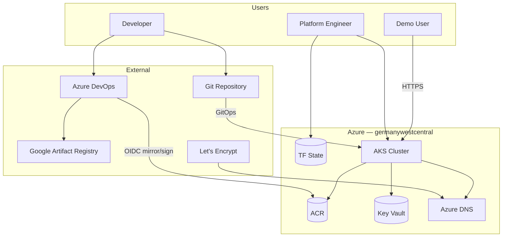
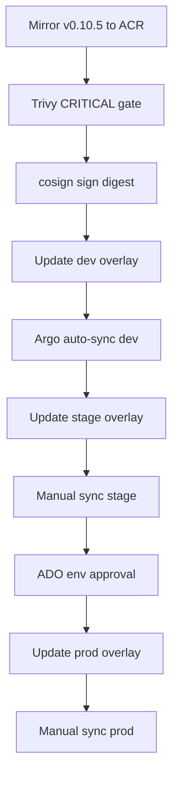

# Architecture — boutique-aks-devsecops

**Maturity:** Production pilot (single cluster). Limitations and CI story are stated in the [README](README.md#limitations).
**Region:** `germanywestcentral` (Germany West Central)
**Application:** Online Boutique [v0.10.5](https://github.com/GoogleCloudPlatform/microservices-demo/releases/tag/v0.10.5)

**Deep docs:** [docs/architecture/](docs/architecture/README.md)
**Implementation plan:** [docs/implementation/plan.md](docs/implementation/plan.md)
**Version pins:** [versions.yaml](versions.yaml)

---

## 1. Requirements

### Functional

| ID | Requirement | Architectural implication |
|----|-------------|---------------------------|
| FR-01 | Terraform: RG, remote state, VNet, NSG, Azure DNS `biroltilki.art` | `terraform/bootstrap/`, `terraform/environments/dev/`, networking + dns modules |
| FR-02 | AKS + WI, ACR, Key Vault, Entra RBAC, kubelet AcrPull, ADO OIDC | `terraform/modules/{aks,acr,key-vault,identities,ado-federation}/` |
| FR-03 | GitOps platform: Argo CD, NGINX, cert-manager, CSI, Kyverno, monitoring | `gitops/bootstrap/`, `gitops/platform/`, `policies/` |
| FR-04 | ADO: mirror, Trivy gate, cosign sign, digest GitOps promotion | `pipelines/` → `gitops/apps/boutique/overlays/` |

### Non-functional

| Category | Requirement | Reference |
|----------|-------------|-----------|
| Security | Least privilege; no secrets in Git; signed images | [07-security-architecture.md](docs/architecture/07-security-architecture.md) |
| Observability | Metrics, dashboards, alerts, SLO | [10-observability.md](docs/architecture/10-observability.md) |
| Cost | One cluster; teardown destroys ACR | [11-cost-model.md](docs/architecture/11-cost-model.md) |
| Reproducibility | Pinned `versions.yaml`; remote TF state | Phase 1 bootstrap |

See [01-requirements.md](docs/architecture/01-requirements.md).

---

## 2. Constraints

| Constraint | Design impact |
|------------|---------------|
| Azure only | `azurerm` provider; Azure-native identity and secrets |
| One AKS cluster | Namespace isolation for dev/stage/prod |
| Budget minimal | `Standard_D2s_v6` system + `Standard_D4s_v6` user pool |
| No long-lived CI secrets | ADO OIDC federation |
| Destroy ACR on teardown | Phase 14 removes all mirrored images |

---

## 3. Assumptions

| Assumption | Validate in |
|------------|-------------|
| Azure subscription admin | Phase 0 |
| DNS `biroltilki.art` delegatable to Azure DNS | Phase 2 |
| Dsv6 SKUs available in `germanywestcentral` | Phase 0/3 (`az vm list-skus`) |
| ADO federation rights | Phase 4 |

---

## 4. High-level architecture

Terraform provisions Azure: VNet, AKS (Workload Identity), ACR, Key Vault, and Azure DNS. **Logs are in-cluster via Loki** ([ADR-0012](docs/adr/0012-loki-in-cluster-logging.md)) — Azure Log Analytics is not deployed on the default test path. Argo CD reconciles platform Helm/Kustomize and Boutique overlays from `gitops/`. Azure DevOps mirrors upstream v0.10.5 images to ACR, Trivy-scans (fail CRITICAL), cosign-signs by digest (`--tlog-upload=false`), then updates GitOps overlays. Kyverno enforces ACR allowlist, denies `:latest`, verifies signatures, and applies Pod Security baseline. NGINX Ingress + cert-manager expose five HTTPS hostnames via Let's Encrypt DNS-01.

### Layers

| Layer | Components | Repo path |
|-------|------------|-----------|
| Infrastructure | VNet, AKS, ACR, KV, DNS | `terraform/` |
| Logging | Loki + Promtail (in-cluster) | `gitops/platform/monitoring/` |
| Platform | Argo CD, NGINX, cert-manager, CSI, Kyverno, monitoring | `gitops/platform/` |
| Applications | Online Boutique v0.10.5 | `gitops/apps/boutique/` |
| Policy | Kyverno cluster policies | `policies/` |
| CI/CD | ADO mirror/scan/sign/promote | `pipelines/` |

### Environments (one cluster)

| Env | Namespace | Hostname | Argo sync | Prod gate |
|-----|-----------|----------|-----------|-----------|
| dev | `boutique-dev` | `dev-boutique.biroltilki.art` | Auto | — |
| stage | `boutique-stage` | `stage-boutique.biroltilki.art` | Manual | — |
| prod | `boutique-prod` | `boutique.biroltilki.art` | Manual | **ADO environment approval** |

### Node pools (locked)

| Pool | VM SKU | vCPU / RAM |
|------|--------|------------|
| System | `Standard_D2s_v6` | 2 / 8 GiB |
| User | `Standard_D4s_v6` | 4 / 16 GiB (autoscaler 1–3) |

---

## 5. Component diagram

**Prose:** Engineers provision with Terraform and operate via GitOps. Pipelines mirror Google public images into private ACR, scan and sign, then update Git. Users reach Boutique and platform UIs through NGINX on shared ingress.

Full diagram: [03-component-design.md](docs/architecture/03-component-design.md).

---

## 6. Data flows

| Flow | Document |
|------|----------|
| Application requests | [04-data-flows.md](docs/architecture/04-data-flows.md) |
| GitOps / supply chain | [04-data-flows.md](docs/architecture/04-data-flows.md) |
| Telemetry | [10-observability.md](docs/architecture/10-observability.md) |
| Secrets (KV → CSI) | [07-security-architecture.md](docs/architecture/07-security-architecture.md) |

---

## 7. Deployment flow

Details: [05-deployment-flow.md](docs/architecture/05-deployment-flow.md).

---

## 8. Network

VNet with AKS subnet; Azure CNI; single NGINX Load Balancer; five hostnames → same ingress IP. Outbound via AKS managed egress. See [06-network-design.md](docs/architecture/06-network-design.md).

---

## 9. Security boundaries

| Zone | Controls |
|------|----------|
| Internet | TLS at ingress |
| Cluster edge | cert-manager, ingress rules |
| Admission | Kyverno verifyImages + PSS baseline |
| Secrets | Key Vault + CSI + Workload Identity |
| CI | OIDC; no secrets in Git |

Details: [07-security-architecture.md](docs/architecture/07-security-architecture.md).

---

## 10. Failure scenarios

| Scenario | Mitigation |
|----------|------------|
| Node loss | ReplicaSets; cluster autoscaler |
| GitOps desync | Argo CD UI; manual sync/rollback |
| Unsigned image deploy | Kyverno deny |
| cert-manager failure | DNS-01 troubleshooting runbook |
| TF state lock | Blob versioning; break lease procedure |

Full table: [08-resilience-and-dr.md](docs/architecture/08-resilience-and-dr.md).

---

## 11. Scalability

User pool autoscales 1–3 × `Standard_D4s_v6`. Full Boutique × 3 namespaces is the designed ceiling for this pilot; the reference test often runs a **slim** Boutique (core storefront only) for pod capacity. Bottleneck: node CPU and maxPods — mitigate with autoscale and optional HPA on frontend.

---

## 12. Disaster recovery

**RTO:** 4–8 hours rebuild from Git + Terraform. **RPO:** TF state 0 with versioning; Redis cart ephemeral. Multi-region out of scope. Rebuild order in [08-resilience-and-dr.md](docs/architecture/08-resilience-and-dr.md).

---

## 13. Observability

kube-prometheus-stack (Prometheus, Grafana, Alertmanager) + Loki/Promtail + OTel collector baseline. Grafana at `grafana-boutique.biroltilki.art`. In-cluster logging per [ADR-0012](docs/adr/0012-loki-in-cluster-logging.md). [10-observability.md](docs/architecture/10-observability.md).

---

## 14. Cost

~€150–250/month order-of-magnitude with 2 nodes active. Teardown Phase 14 destroys ACR and AKS. [11-cost-model.md](docs/architecture/11-cost-model.md).

---

## 15. Tradeoffs

| Decision | Chosen | Alternative | Cost of choice |
|----------|--------|-------------|----------------|
| Single cluster | 3 namespaces | Multi-cluster | Shared blast radius |
| Kyverno only | Admission in-cluster | Azure Policy | No subscription K8s policy |
| Key-based cosign 2.2.x | `--tlog-upload=false` | Keyless Fulcio | Key rotation duty |
| Mirror upstream | Pull v0.10.5 | Build from source | Less custom CI demo |
| Destroy ACR on teardown | Clean cost stop | Retain images | Re-mirror on rebuild |

---

## 16. Future enhancements

| Item | Prerequisite |
|------|--------------|
| Azure AD SSO for Argo CD | Entra app registration |
| Trivy vuln attestations | Stretch (SPDX SBOM attestations: Topic 17 / ADR-0014) |
| Service mesh | Stable baseline |
| NetworkPolicy default deny | Topic 15 scaffold (`base/networkpolicies/`); enforce via `aks_network_policy=azure` on rebuild |

See [ROADMAP.md](ROADMAP.md).

---

## Proposed ADRs

| ADR | Topic |
|-----|-------|
| [0001](docs/adr/0001-azure-cloud-provider.md) | Azure as sole cloud |
| [0002](docs/adr/0002-single-cluster-multi-namespace.md) | Single AKS, three envs |
| [0003](docs/adr/0003-kyverno-admission.md) | Kyverno admission |
| [0004](docs/adr/0004-argocd-gitops.md) | Argo CD GitOps |
| [0005](docs/adr/0005-cosign-key-based-signing.md) | cosign key-based signing |
| [0006](docs/adr/0006-kustomize-boutique.md) | Kustomize for Boutique |
| [0007](docs/adr/0007-no-service-mesh.md) | No service mesh v1 |
| [0008](docs/adr/0008-ado-prod-approval-gate.md) | ADO env approval for prod |
| [0009](docs/adr/0009-mirror-upstream-images.md) | Mirror v0.10.5 images |
| [0010](docs/adr/0010-destroy-acr-on-teardown.md) | Destroy ACR on teardown |
| [0011](docs/adr/0011-aks-node-vm-sku.md) | Node VM SKUs and region |

---

## Component → repo → setup

| Component | Repo path | Setup topic |
|-----------|-----------|-------------|
| Remote state | `terraform/bootstrap/` | 01-terraform-bootstrap |
| VNet, DNS | `terraform/modules/networking/`, `dns/` | 02-azure-foundation |
| AKS, ACR, KV | `terraform/modules/aks/`, `acr/`, `key-vault/` | 03-cluster-resources |
| ADO OIDC | `terraform/modules/ado-federation/` | 04-ado-oidc |
| Argo CD | `gitops/bootstrap/` | 05-gitops-bootstrap |
| Ingress + TLS | `gitops/platform/ingress-nginx/`, `cert-manager/` | 06-ingress-tls |
| CSI | `gitops/platform/secrets-store-csi/` | 07-secrets-csi |
| Kyverno | `gitops/platform/kyverno/`, `policies/` | 08-admission-policies |
| CI | `pipelines/` | 09-ci-pipeline |
| Boutique | `gitops/apps/boutique/` | 10-boutique-dev, 12-promotion |
| Monitoring | `gitops/platform/monitoring/` | 11-observability |
| Teardown | `scripts/operations/teardown.sh` | 13-teardown |
