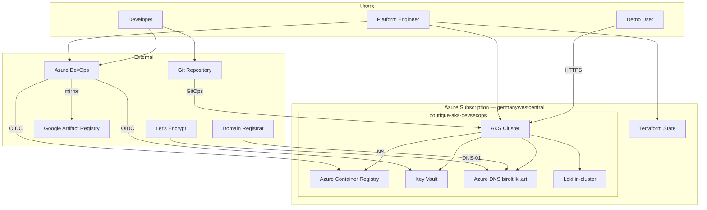

# System context

## Actors

| Actor | Interactions |
|-------|--------------|
| Platform engineer | Terraform, kubectl, Argo CD, Azure Portal |
| Developer | Git push, ADO pipeline runs |
| Demo user | HTTPS to Boutique hostnames |
| Let's Encrypt | DNS-01 challenges against Azure DNS |
| Google Artifact Registry | Read-only pull for mirror pipeline |

## External dependencies

| System | Purpose | Failure impact |
|--------|---------|----------------|
| Azure subscription | Hosts all infrastructure | Total outage |
| Domain registrar | NS delegation to Azure DNS | TLS issuance blocked |
| Azure DevOps | CI/CD, prod approval gate | No new images/promotions |
| Google sample images | Boutique v0.10.5 source | Mirror pipeline blocked |

## Context diagram

**Prose:** The platform runs entirely in one Azure region. External touchpoints are Git (desired state), ADO (build/sign/promote), Google public images (upstream), and the domain registrar (DNS delegation). Users never pull images directly from Google at runtime — only from ACR after mirror/sign.
