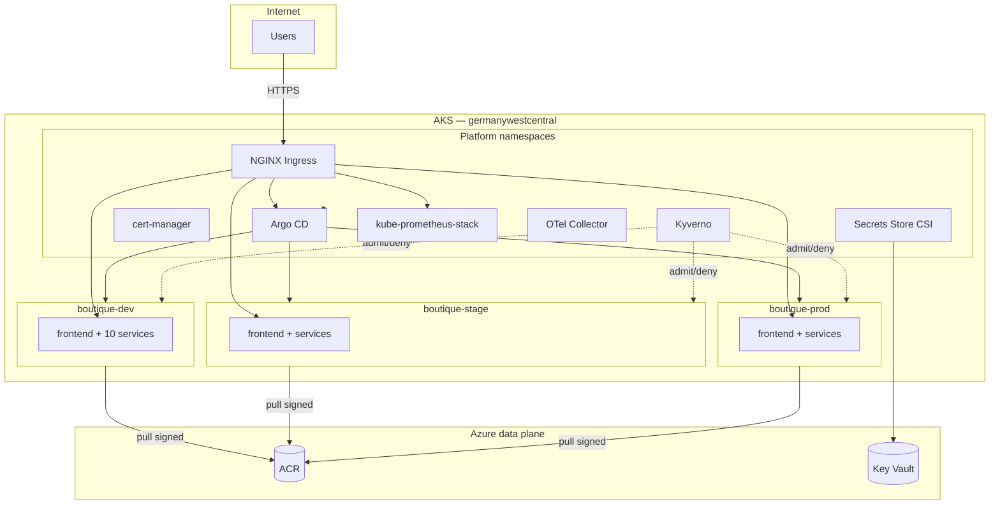

# Component design

## In-cluster components

**Prose:** NGINX is the single north-south entry. Argo CD reconciles all namespaces. Kyverno admission applies to Boutique namespaces. Platform metrics collected via Prometheus ServiceMonitors.

## Terraform components

| Module | Delivers |
|--------|----------|
| `resource-group` | Platform RG |
| `networking` | VNet, AKS subnet, NSG |
| `dns` | Zone `biroltilki.art` |
| `diagnostics` | Optional Log Analytics (not wired in default lab; see ADR-0012) |
| `aks` | Cluster, node pools (D2s_v5 / D4s_v5) |
| `acr` | Container registry |
| `key-vault` | Secrets store |
| `identities` | WI, kubelet AcrPull |
| `ado-federation` | OIDC app + federated credential |

## Scalability

| Dimension | Approach |
|-----------|----------|
| Horizontal | User pool autoscaler 1–3; optional HPA on frontend |
| Vertical | `Standard_D4s_v5` user nodes |
| Multi-tenancy | Namespace + RBAC + Kyverno |
| Ceiling | Full Boutique × 3 envs on one cluster (pilot) |

### Bottlenecks

1. **Node CPU** — mitigate with autoscale and right-sized requests
2. **Ingress LB throughput** — single controller; acceptable for pilot
3. **Prometheus storage** — limit retention (15d default)

## Repo mapping

| Component | Path |
|-----------|------|
| IaC | `terraform/` |
| GitOps platform | `gitops/platform/` |
| GitOps apps | `gitops/apps/boutique/` |
| Policies | `policies/kyverno/` |
| CI | `pipelines/` |
