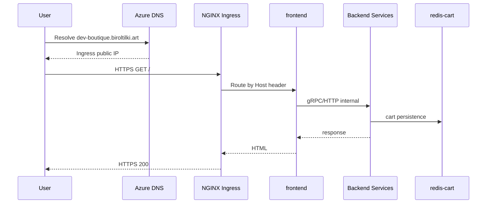
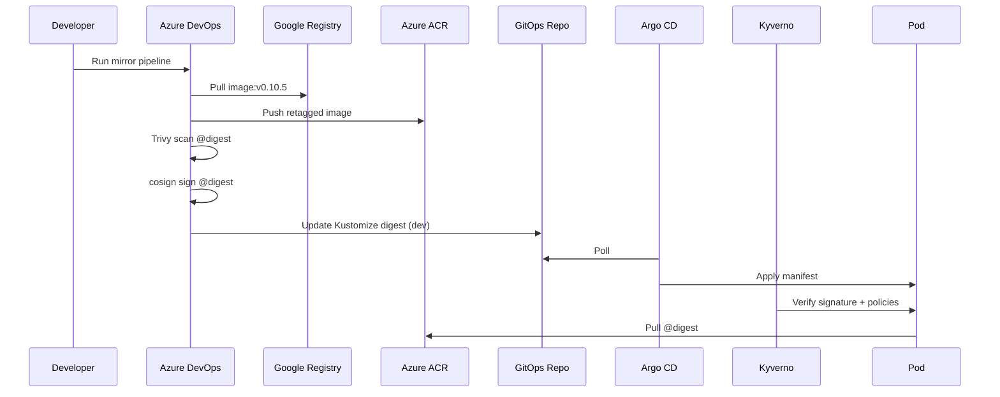
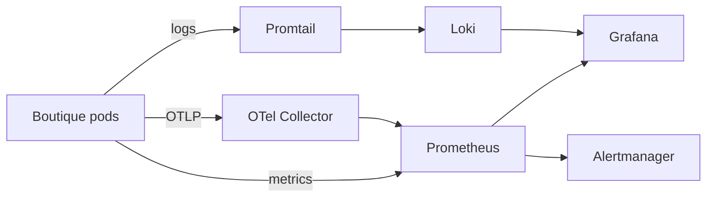
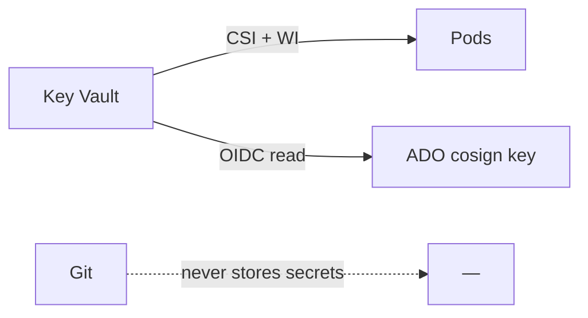

# Data flows

## Application request flow

**Prose:** External traffic terminates TLS at NGINX. The frontend proxies to internal ClusterIP services. Only the frontend is exposed via Ingress per environment.

## GitOps and supply chain flow

**Order rule:** Scan before sign; sign the same digest that was scanned.

## Telemetry flow

## Secrets flow

Git stores only SecretProviderClass references and non-secret configuration.

## Infrastructure flow

`terraform plan/apply` → Azure Resource Manager → resources; state persisted to Azure Storage blob with locking.
