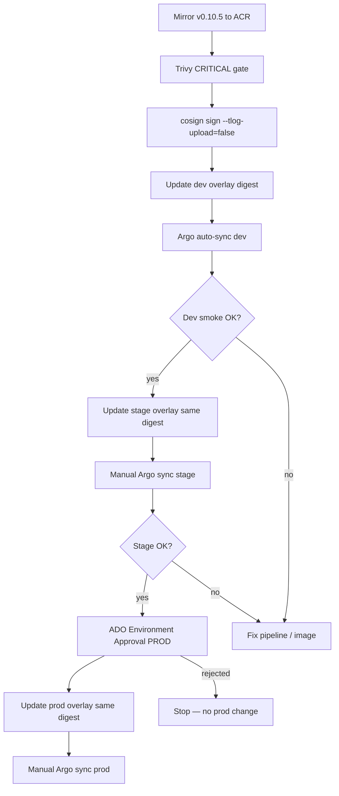

# Deployment flow

## Promotion path

## CI pipeline stages (Azure DevOps)

| Stage | Actions | Repo |
|-------|---------|------|
| Mirror | Pull GAR → push ACR per service | `pipelines/azure-pipelines.yml` |
| Scan | `trivy image --severity CRITICAL --exit-code 1 @digest` | `templates/build-scan-sign.yml` |
| Sign | `cosign sign --key ... --tlog-upload=false @digest` | same |
| Promote-dev | Commit digest to `overlays/dev` | pipeline or manual PR |
| Promote-stage/prod | Update overlays; prod requires ADO approval | `templates/promote-digest.yml` |

## GitOps model

- **Root app** → platform apps + boutique apps
- **Sync waves:** CRDs → cert-manager → ingress → kyverno → policies → applications
- **Health:** Argo CD + frontend `/_healthz` endpoint

## Rollback

| Layer | Mechanism |
|-------|-----------|
| Application | Git revert digest in overlay; manual Argo sync |
| Platform | Argo CD history rollback |
| Infrastructure | Terraform state revert + apply |

**Note:** Phase 14 destroys ACR — rollback to a prior digest requires the image still exist in ACR or re-run mirror pipeline.

## Human gates

| Gate | Mechanism |
|------|-----------|
| Stage deploy | Manual Argo sync |
| Prod deploy | **ADO environment approval** + manual Argo sync |
| Policy enforcement | Kyverno `failurePolicy: Fail` |
