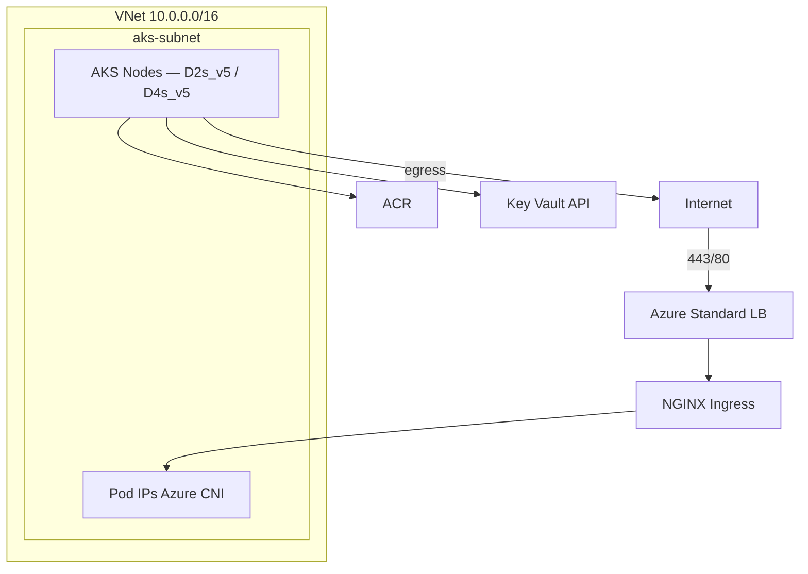

# Network design

## Region and addressing

| Field | Value |
|-------|-------|
| Azure region | `germanywestcentral` |
| VNet CIDR (planned) | `10.0.0.0/16` |
| AKS subnet (planned) | `10.0.0.0/20` |
| Kubernetes service CIDR | `10.1.0.0/16` (must not overlap node subnet) |
| CoreDNS service IP | `10.1.0.10` |
| CNI | Azure CNI |

## VPC layout

**Prose:** All nodes live in a dedicated AKS subnet. North-south traffic enters via one Azure Load Balancer fronting NGINX. East-west traffic stays within the cluster virtual network.

## Ingress path

`Internet → Azure LB → NGINX Ingress Controller → Service → Pod`

## Public hostnames (single ingress IP)

| FQDN | Backend |
|------|---------|
| `argocd-boutique.biroltilki.art` | Argo CD server |
| `grafana-boutique.biroltilki.art` | Grafana |
| `dev-boutique.biroltilki.art` | frontend (boutique-dev) |
| `stage-boutique.biroltilki.art` | frontend (boutique-stage) |
| `boutique.biroltilki.art` | frontend (boutique-prod) |

## DNS flow

1. Registrar delegates `biroltilki.art` NS to Azure DNS name servers
2. `A` records for each hostname point to ingress public IP
3. cert-manager creates `_acme-challenge.*` TXT records for DNS-01

## Ports summary

| Path | Port | Protocol |
|------|------|----------|
| User → Ingress | 443 | HTTPS |
| Ingress → frontend | 80 → 8080 | HTTP |
| Internal gRPC | 3550, 50051, 7000, etc. | gRPC |
| Kubernetes API | 443 | HTTPS (AAD auth) |

## Segmentation (v1)

| Control | Status |
|---------|--------|
| NSG on AKS subnet | Terraform module |
| Kyverno pod hardening | Enforced Phase 8 |
| Kubernetes NetworkPolicy | Optional Phase 13 |
| Private ACR | Deferred |

## Egress

Pods and nodes pull images from ACR, reach Let's Encrypt via cert-manager, and access Azure APIs (Key Vault, DNS) via Azure backbone and managed outbound.
