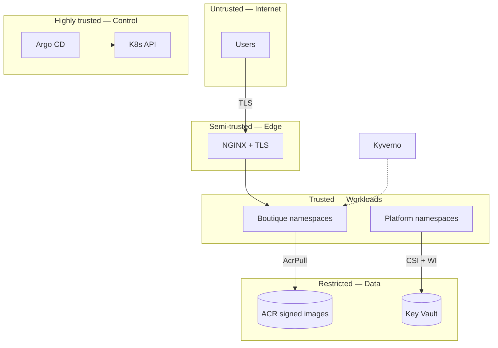

# Security architecture

## Trust zones

| Zone | Trust level | Controls |
|------|-------------|----------|
| Internet | Untrusted | TLS 1.2+, ingress routing |
| Cluster edge | Semi-trusted | cert-manager certs |
| Cluster interior | Trusted tenant | RBAC, Kyverno, PSA baseline |
| Control plane | Highly trusted | Entra AAD k8s admin |
| Data plane | Restricted | Encryption at rest/transit, RBAC |

## Identity

| Principal | Access path |
|-----------|-------------|
| Human engineer | Entra → Azure RBAC + AKS AAD RBAC |
| ADO pipeline | OIDC federated credential → ACR push, KV secret read |
| Kubelet | Managed identity → AcrPull |
| Workload pods | Workload Identity → Key Vault GET |
| cert-manager | Workload Identity → Azure DNS zone for DNS-01 |

## Secrets management

| Secret type | Store | Delivery |
|-------------|-------|----------|
| Cosign private key | Key Vault | ADO OIDC or CSI |
| Grafana admin | Key Vault | CSI |
| TLS certs | Kubernetes secrets (cert-manager) | In-cluster |
| App config | ConfigMaps | Git (non-sensitive only) |

**Never in Git:** keys, passwords, connection strings, `terraform.tfvars` with secrets.

## Supply chain

| Control | Tool | Phase |
|---------|------|-------|
| Vulnerability gate | Trivy CRITICAL fail | 9 |
| Integrity | cosign 2.2.4 key-based sign | 9 |
| Admission verify | Kyverno verifyImages | 8 |
| Registry allowlist | Kyverno | 8 |
| Deny `:latest` | Kyverno | 8 |

Kyverno policy must set `rekor.ignoreTlog: true` and `ctlog.ignoreSCT: true` to match `cosign sign --tlog-upload=false`.

## Blast radius

| Compromised component | Exposure |
|-----------------------|----------|
| ADO pipeline (OIDC) | Scoped ACR push + sign key read |
| Argo CD admin | All cluster manifests |
| Boutique pod | Cluster network + NetworkPolicy allow-list (Topic 15 scaffold; enforce with Azure NPM) |
| Single namespace | Other namespaces without RBAC breakout |

## Tradeoffs

| Decision | Chosen | Alternative | Cost |
|----------|--------|-------------|------|
| Admission | Kyverno | Azure Policy | No subscription policy |
| Signing | cosign key | Keyless | Key rotation |
| Prod gate | ADO env approval | PR reviewers | Simpler solo flow |
| Teardown | Destroy ACR | Retain registry | Re-mirror cost |

See [../adr/](../adr/README.md).
