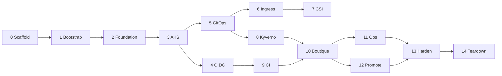

# Implementation plan

**Status:** Setup Topics **00–13** complete; Azure lab torn down. Phase 13 hardening deferred (⏭️).
**Architecture:** [ARCHITECTURE.md](../../ARCHITECTURE.md)
**Roadmap:** [ROADMAP.md](../../ROADMAP.md)

---

## 1. Executive summary

| Field | Value |
|-------|-------|
| Project | boutique-aks-devsecops |
| Goal | Production-pilot Azure DevSecOps for Online Boutique v0.10.5 on AKS |
| Phases | 15 (0–14) |
| Region | `germanywestcentral` |
| Node SKUs | System `Standard_D2s_v6`, User `Standard_D4s_v6` |
| Done | FR-01–FR-04 met; policies enforce; observability + promotion executed; teardown documented |

---

## 2. Project goals

| ID | Goal | Success indicator |
|----|------|-------------------|
| G-01 | Reproducible Azure foundation | Remote TF state; clean `terraform apply` |
| G-02 | Three logical envs on one cluster | Namespaces + distinct ingress hosts |
| G-03 | Secure supply chain | Trivy + cosign + Kyverno verify |
| G-04 | Digest GitOps promotion | Same `@sha256` in stage/prod as dev |
| G-05 | Observability | Grafana + test alert + SLO doc |
| G-06 | Teachable reference | Setup 00–13 complete |

---

## 3. Business value

- End-to-end Azure DevSecOps portfolio piece
- Educational docs with rationale (why OIDC, Kyverno, GitOps)
- Realistic promotion and rollback on microservices
- Cost-conscious single cluster with teardown path

---

## 4. Functional requirements

| ID | Requirement | Phase |
|----|-------------|-------|
| FR-01 | TF: RG, state, VNet, DNS | 1–2 |
| FR-02 | AKS, ACR, KV, OIDC | 3–4 |
| FR-03 | GitOps platform services | 5–8, 11 |
| FR-04 | ADO mirror/scan/sign/promote | 9–12 |

---

## 5. Non-functional requirements

See [docs/architecture/01-requirements.md](../architecture/01-requirements.md).

---

## 6. Assumptions

| Assumption | Validate |
|------------|----------|
| Azure admin | Phase 0 |
| DNS delegation | Phase 2 |
| Dsv6 in germanywestcentral | Phase 0/3 |
| ADO federation rights | Phase 4 |

---

## 7. Constraints

Azure only; one cluster; no secrets in Git; digest-pinned images; destroy ACR on teardown; ADO env approval for prod only.

---

## 8. Scope

**In:** Terraform, GitOps, Kyverno, ADO CI, Boutique v0.10.5, observability, runbooks, teardown.
**Out:** Multi-region DR, service mesh, Azure Policy duplicate, Trivy attestations v1.

---

## 9. Risks

| Risk | Mitigation |
|------|------------|
| OIDC mismatch | `scripts/verify-oidc-trust.sh` |
| DNS/TLS delay | Validate NS before Phase 6 |
| Kyverno vs busybox/redis | Kustomize patches |
| cosign/Kyverno tlog | `--tlog-upload=false` + `ignoreTlog` |
| XL mirror pipeline | Loop over 11 services |

---

## 10. Dependencies

External: Azure sub, DNS registrar, ADO. Internal: phase order per roadmap.

---

## 11. Technology stack

See [versions.yaml](../../versions.yaml).

---

## 12. Architecture

[ARCHITECTURE.md](../../ARCHITECTURE.md) and [docs/architecture/](../architecture/).

---

## 13. Repository organization

Variant A adapted: `terraform/`, `gitops/`, `policies/`, `pipelines/`. See root [README.md](../../README.md).

---

## 14. Milestones

| Milestone | Phases |
|-----------|--------|
| M1 Repo & state | 0–1 |
| M2 Azure foundation | 2–3 |
| M3 Trust & GitOps | 4–5 |
| M4 Platform | 6–8 |
| M5 Secure delivery | 9–10 |
| M6 Operate | 11–12 |
| M7 Complete | 13–14 |

---

## 15. Deliverables

See [ROADMAP.md](../../ROADMAP.md) phase table.

---

## 16. Implementation phases (summary)

| Phase | Title | Complexity | Setup topic |
|-------|-------|------------|-------------|
| 0 | Repository scaffold | S | 00-prerequisites |
| 1 | TF bootstrap | M | 01-terraform-bootstrap |
| 2 | Azure foundation | M | 02-azure-foundation |
| 3 | AKS, ACR, KV | L | 03-cluster-resources |
| 4 | ADO OIDC | M | 04-ado-oidc |
| 5 | GitOps bootstrap | M | 05-gitops-bootstrap |
| 6 | Ingress + TLS | L | 06-ingress-tls |
| 7 | Secrets CSI | M | 07-secrets-csi |
| 8 | Kyverno | L | 08-admission-policies |
| 9 | CI pipeline | XL | 09-ci-pipeline |
| 10 | Boutique dev | L | 10-boutique-dev |
| 11 | Observability | M | 11-observability |
| 12 | Promotion | XL | 12-promotion-stage-prod |
| 13 | Hardening | M | — |
| 14 | Teardown | M | 13-teardown |

Each phase: one PR, validation checklist, approval gate before next.

**Detailed per-phase tasks** were approved in planning session; expand in setup topics when each phase starts.

---

## 17. Complexity summary

Peaks: Phase 9 (mirror/sign), Phase 12 (promotion). Overall **L** for solo builder.

---

## 18. Success criteria

- [ ] FR-01–FR-04 delivered
- [ ] All phases validated
- [ ] Setup 00–13 complete
- [ ] Policies deny unsigned/:latest/non-ACR
- [ ] Teardown runbook executed once
- [ ] New engineer can bootstrap from docs

---

## Cross-reference map

| Phase | Setup topic | Key paths | FR |
|-------|-------------|-----------|-----|
| 0 | 00 | README, versions.yaml, ARCHITECTURE | — |
| 1 | 01 | terraform/bootstrap/ | FR-01 |
| 2 | 02 | modules/networking, dns | FR-01 |
| 3 | 03 | modules/aks, acr, key-vault | FR-01,02 |
| 4 | 04 | ado-federation | FR-02 |
| 5 | 05 | gitops/bootstrap/ | FR-03 |
| 6 | 06 | platform/ingress, cert-manager | FR-03 |
| 7 | 07 | platform/secrets-store-csi | FR-02,03 |
| 8 | 08 | policies/, platform/kyverno | FR-03 |
| 9 | 09 | pipelines/ | FR-04 |
| 10 | 10 | gitops/apps/boutique/overlays/dev | FR-03,04 |
| 11 | 11 | platform/monitoring | FR-03 |
| 12 | 12 | overlays/stage,prod | FR-03,04 |
| 14 | 13 | scripts/operations/teardown.sh | — |

---

## Roadmap diagram

