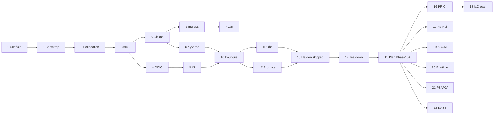

# Implementation plan

**Status:** Setup Topics **00–13** complete; Azure test torn down. Phase 13 hardening deferred (⏭️), superseded by **Phase 15+** scaffold-first work ([phase15-plus.md](phase15-plus.md), [ADR-0013](../adr/0013-scaffold-first-phase15.md)).
**Architecture:** [ARCHITECTURE.md](../../ARCHITECTURE.md)
**Roadmap:** [ROADMAP.md](../../ROADMAP.md)

---

## 1. Executive summary

| Field | Value |
|-------|-------|
| Project | boutique-aks-devsecops |
| Goal | Production-pilot Azure DevSecOps for Online Boutique v0.10.5 on AKS |
| Phases | 0–14 complete (lived pilot); 15–22 scaffold-first (Phase 15+) |
| Region | `germanywestcentral` |
| Node SKUs | System `Standard_D2s_v6`, User `Standard_D4s_v6` |
| Lived pilot done | FR-01–FR-04 met; policies enforce; observability + promotion executed; teardown documented |
| Phase 15+ mode | Scaffold files + setup Topics 14–20 **without** live Azure; apply after rebuild |

---

## 2. Project goals

| ID | Goal | Success indicator |
|----|------|-------------------|
| G-01 | Reproducible Azure foundation | Remote TF state; clean `terraform apply` |
| G-02 | Three logical envs on one cluster | Namespaces + distinct ingress hosts |
| G-03 | Secure supply chain | Trivy + cosign + Kyverno verify |
| G-04 | Digest GitOps promotion | Same `@sha256` in stage/prod as dev |
| G-05 | Observability | Grafana + test alert + SLO doc |
| G-06 | Teachable reference | Setup 00–13 complete |
| G-07 | PR-time gates | ADO PR pipeline fails on lint / TF / Kyverno test |
| G-08 | East-west isolation | NetworkPolicies for Boutique graph |
| G-09 | IaC scanning | Checkov (or tfsec) in CI |
| G-10 | SBOM + attestations | Artifacts + policy path documented |
| G-11 | Runtime detection | Falco and/or Defender for Containers |
| G-12 | Namespace / KV hardening | PSA, quotas, KV network ACL |
| G-13 | Optional DAST | ZAP baseline job template |

---

## 3. Business value

- End-to-end Azure DevSecOps portfolio piece
- Educational docs with rationale (why OIDC, Kyverno, GitOps)
- Realistic promotion and rollback on microservices
- Cost-conscious single cluster with teardown path
- **Phase 15+:** deeper shift-left and runtime controls without requiring Azure burn to author them

---

## 4. Functional requirements

| ID | Requirement | Phase |
|----|-------------|-------|
| FR-01 | TF: RG, state, VNet, DNS | 1–2 |
| FR-02 | AKS, ACR, KV, OIDC | 3–4 |
| FR-03 | GitOps platform services | 5–8, 11 |
| FR-04 | ADO mirror/scan/sign/promote | 9–12 |
| FR-05 | ADO PR pipeline (lint / TF / Kyverno) | 16 |
| FR-06 | Boutique NetworkPolicies | 17 |
| FR-07 | IaC scanner on `terraform/` | 18 |
| FR-08 | SBOM + cosign attestations | 19 |
| FR-09 | Runtime security (Falco/Defender) | 20 |
| FR-10 | KV ACL + PSA / quotas | 21 |
| FR-11 | Optional DAST against storefront | 22 |

---

## 5. Non-functional requirements

See [docs/architecture/01-requirements.md](../architecture/01-requirements.md).

---

## 6. Assumptions

| Assumption | Validate |
|------------|----------|
| Azure admin | Phase 0 |
| DNS delegation | Phase 2 |
| Dsv6 in germanywestcentral | Phase 0/3 |
| ADO federation rights | Phase 4 |
| Phase 15+ scaffold readable without live cluster | Phase 15 |
| Topics 14–20 apply after Topics 00–12 rebuild | Topics 14–20 |

---

## 7. Constraints

Azure only; one cluster; no secrets in Git; digest-pinned images; destroy ACR on teardown; ADO env approval for prod only; **no GitHub Actions**; scaffold packages must not require `terraform apply`.

---

## 8. Scope

**In (lived pilot):** Terraform, GitOps, Kyverno, ADO CI, Boutique v0.10.5, observability, runbooks, teardown.
**In (Phase 15+):** PR CI, NetworkPolicies, IaC scan, SBOM/attestations, runtime security, KV ACL + PSA/quotas, optional DAST — scaffold then apply.
**Out:** Multi-region DR, service mesh, Azure Policy duplicate, private AKS/ACR as required, WAF/DDoS, build-from-source app SAST, HSM cosign keys.

---

## 9. Risks

| Risk | Mitigation |
|------|------------|
| OIDC mismatch | `scripts/verify-oidc-trust.sh` |
| DNS/TLS delay | Validate NS before Phase 6 |
| Kyverno vs busybox/redis | Kustomize patches |
| cosign/Kyverno tlog | `--tlog-upload=false` + `ignoreTlog` |
| XL mirror pipeline | Loop over 11 services |
| Scaffold mistaken for lived proof | ADR-0013; Apply later sections in Topics 14–20 |
| Phase 13 vs 15+ confusion | Phase 13 stays ⏭️; Phase 15+ owns hardening backlog |

---

## 10. Dependencies

External: Azure sub, DNS registrar, ADO. Internal: lived-pilot phase order per roadmap; Phase 15+ packages 2–8 after Package 1 inventory.

---

## 11. Technology stack

See [versions.yaml](../../versions.yaml). Phase 15+ may pin Checkov, Syft/Trivy SBOM, Falco chart versions when those packages land.

---

## 12. Architecture

[ARCHITECTURE.md](../../ARCHITECTURE.md) and [docs/architecture/](../architecture/).

---

## 13. Repository organization

Variant A adapted: `terraform/`, `gitops/`, `policies/`, `pipelines/`. See root [README.md](../../README.md).

---

## 14. Milestones

| Milestone | Phases |
|-----------|--------|
| M1 Repo & state | 0–1 |
| M2 Azure foundation | 2–3 |
| M3 Trust & GitOps | 4–5 |
| M4 Platform | 6–8 |
| M5 Secure delivery | 9–10 |
| M6 Operate | 11–12 |
| M7 Complete | 13–14 |
| M8a Plan | 15 |
| M8b Shift-left CI | 16, 18 |
| M8c Cluster hardening | 17, 21 |
| M8d Supply chain depth | 19 |
| M8e Runtime + DAST | 20, 22 |

---

## 15. Deliverables

See [ROADMAP.md](../../ROADMAP.md) phase tables and [phase15-plus.md](phase15-plus.md) package checklist.

---

## 16. Implementation phases (summary)

### Lived pilot (Topics 00–13)

| Phase | Title | Complexity | Setup topic |
|-------|-------|------------|-------------|
| 0 | Repository scaffold | S | 00-prerequisites |
| 1 | TF bootstrap | M | 01-terraform-bootstrap |
| 2 | Azure foundation | M | 02-azure-foundation |
| 3 | AKS, ACR, KV | L | 03-cluster-resources |
| 4 | ADO OIDC | M | 04-ado-oidc |
| 5 | GitOps bootstrap | M | 05-gitops-bootstrap |
| 6 | Ingress + TLS | L | 06-ingress-tls |
| 7 | Secrets CSI | M | 07-secrets-csi |
| 8 | Kyverno | L | 08-admission-policies |
| 9 | CI pipeline | XL | 09-ci-pipeline |
| 10 | Boutique dev | L | 10-boutique-dev |
| 11 | Observability | M | 11-observability |
| 12 | Promotion | XL | 12-promotion-stage-prod |
| 13 | Hardening | M | — (skipped; see Phase 15+) |
| 14 | Teardown | M | 13-teardown |

### Phase 15+ (scaffold packages)

| Phase | Title | Complexity | Setup topic | Package |
|-------|-------|------------|-------------|---------|
| 15 | Backlog & plan | S | phase15-plus.md | 1 ✅ |
| 16 | PR CI gates | M | 14-pr-ci | 2 ✅ |
| 17 | NetworkPolicies | M | 15-network-policies | 3 ✅ |
| 18 | IaC scanning | M | 16-iac-scanning | 4 ✅ |
| 19 | SBOM + attestations | L | 17-sbom-attestations | 5 ✅ |
| 20 | Runtime security | L | 18-runtime-security | 6 ✅ |
| 21 | KV ACL + PSA/quotas | M | 19-namespace-hardening | 7 ✅ |
| 22 | DAST (optional) | M | 20-dast | 8 ✅ |

Each Phase 15+ package: one PR-sized scaffold, setup topic with **Apply later** validation, ROADMAP status update.

---

## 17. Complexity summary

Peaks: Phase 9 (mirror/sign), Phase 12 (promotion), Phase 19 (attestations). Phase 15+ scaffold overall **M** for solo builder; live apply adds cluster time.

---

## 18. Success criteria

### Lived pilot (Topics 00–13)

- [x] FR-01–FR-04 delivered
- [x] Setup 00–13 complete
- [x] Policies deny unsigned/:latest/non-ACR
- [x] Teardown runbook executed once
- [x] New engineer can bootstrap from docs

### Phase 15+ (scaffold)

- [x] Phase 15 inventory + ADR-0013
- [x] Package 2 / Topic 14 (PR CI) scaffolded
- [x] Package 3 / Topic 15 (NetworkPolicies) scaffolded
- [x] Package 4 / Topic 16 (Checkov IaC) scaffolded
- [x] Package 5 / Topic 17 (SBOM + attestations) scaffolded
- [x] Package 6 / Topic 18 (Falco runtime) scaffolded
- [x] Package 7 / Topic 19 (namespace + KV hardening) scaffolded
- [x] Package 8 / Topic 20 (optional DAST) scaffolded
- [x] ROADMAP Phase 15+ scaffold column complete

### Phase 15+ (apply later — after Azure rebuild)

- [ ] FR-05–FR-11 validated on live cluster per topic checklists

---

## Cross-reference map

| Phase | Setup topic | Key paths | FR |
|-------|-------------|-----------|-----|
| 0 | 00 | README, versions.yaml, ARCHITECTURE | — |
| 1 | 01 | terraform/bootstrap/ | FR-01 |
| 2 | 02 | modules/networking, dns | FR-01 |
| 3 | 03 | modules/aks, acr, key-vault | FR-01,02 |
| 4 | 04 | ado-federation | FR-02 |
| 5 | 05 | gitops/bootstrap/ | FR-03 |
| 6 | 06 | platform/ingress, cert-manager | FR-03 |
| 7 | 07 | platform/secrets-store-csi | FR-02,03 |
| 8 | 08 | policies/, platform/kyverno | FR-03 |
| 9 | 09 | pipelines/ | FR-04 |
| 10 | 10 | gitops/apps/boutique/overlays/dev | FR-03,04 |
| 11 | 11 | platform/monitoring | FR-03 |
| 12 | 12 | overlays/stage,prod | FR-03,04 |
| 14 | 13 | scripts/operations/teardown.sh | — |
| 15 | phase15-plus | docs/implementation/, ADR-0013 | — |
| 16 | 14 | pipelines/azure-pipelines-pr.yml | FR-05 |
| 17 | 15 | gitops/apps/boutique/**/networkpolicy* | FR-06 |
| 18 | 16 | pipelines + Checkov | FR-07 |
| 19 | 17 | build-scan-sign + kyverno attest | FR-08 |
| 20 | 18 | gitops/platform/falco or TF Defender | FR-09 |
| 21 | 19 | key-vault module + namespace manifests | FR-10 |
| 22 | 20 | pipelines DAST template | FR-11 |

---

## Roadmap diagram

