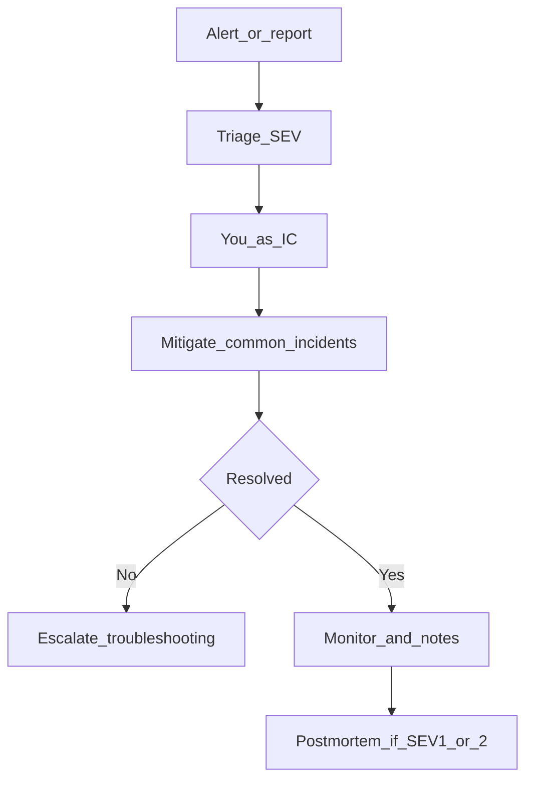

# Incident response

**Audience:** L3 — Operator
**Applies to:** All test environments
**Prerequisites:** kubectl, Grafana access, [runbooks/incident-response.md](../runbooks/incident-response.md)
**Estimated time:** Continuous until mitigated
**Risk level:** High (SEV-1/2)

## Purpose

Triage severity, mitigate user impact, and hand off to common-incident playbooks. Solo-operator calibrated.

## When to use / When not to use

**Use** on alert, user report, or failed smoke.
**Do not** start Terraform destroy as first response.

## Prerequisites

- [ ] Note start time and environment
- [ ] Avoid promoting prod during an open SEV-1/2

## Procedure

### Step 1: Assign SEV

| Severity | Definition | Response (test) | Example |
|----------|------------|----------------|---------|
| **SEV-1** | Total outage / data-loss risk | Immediate | Prod storefront down; API unreachable |
| **SEV-2** | Major degradation | < 30 min | Error rate high; Argo cannot sync; Kyverno down |
| **SEV-3** | Minor impact | < 4 hours | Single non-critical pod CrashLoop |
| **SEV-4** | Low / cosmetic | Next business day | Dashboard gap |



### Step 2: First checks

**Commands:**

```bash
kubectl get nodes
kubectl get application -n argocd | grep -E 'boutique|ingress|kyverno'
./tests/integration/promotion-smoke.sh prod   # or stage/dev as needed
```

**Validation:** SEV confirmed against evidence.

**Expected outcome:** Jump to [17-common-incidents.md](17-common-incidents.md).

**Recovery steps:** Capacity Pending → [04-scaling.md](04-scaling.md).

**Best practices:** Change one variable at a time; log actions.

### Step 3: Contain

- Stop Argo sync to prod if stage broken
- Pause ADO promote approvals
- Do not disable Kyverno Enforce to “unblock”

## End-to-end validation

Smoke passes; alerts clear; brief notes saved for postmortem if SEV-1/2.

## Rollback (section-level)

Use [03-rollback.md](03-rollback.md) for bad deploys.

## Related alerts and dashboards

| Alert | Dashboard | Log query |
|-------|-----------|-----------|
| `BoutiqueFrontendDown` | Boutique Overview | `{namespace=~"boutique-.*"}` |
| `NodeNotReady` | Cluster Overview | — |

Deep checklist: [runbooks/incident-response.md](../runbooks/incident-response.md).

## Security notes

Do not paste secrets into incident chat/logs.

## Automation opportunities

Alertmanager `runbook_url` annotations → these pages ([10-alerting.md](10-alerting.md)).
