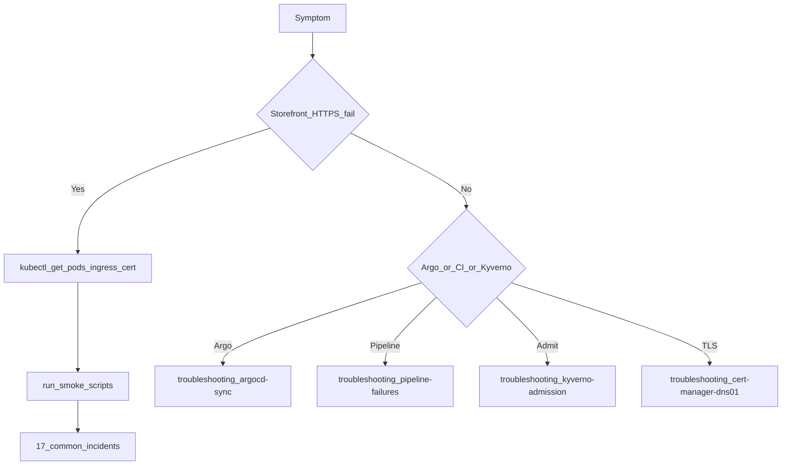

# Troubleshooting

**Audience:** L3 — Operator
**Applies to:** All test components
**Prerequisites:** kubectl; access to [docs/troubleshooting/](../troubleshooting/)
**Estimated time:** Varies
**Risk level:** Medium

## Purpose

Provide a short diagnostic flowchart, then route to symptom-indexed guides (no duplicated long trees).

## When to use / When not to use

**Use** after SEV triage when the first playbook is unclear.
**Do not** copy Setup Guide steps here.

## Prerequisites

- [ ] Start time and SEV noted ([07](07-incident-response.md))

## Procedure

### Step 1: Flowchart



### Step 2: Open the matching guide

| Symptom | Guide |
|---------|-------|
| Argo sync / health | [argocd-sync.md](../troubleshooting/argocd-sync.md) |
| ADO OIDC | [ado-oidc.md](../troubleshooting/ado-oidc.md) |
| Mirror / Trivy / cosign | [pipeline-failures.md](../troubleshooting/pipeline-failures.md) |
| Image signature | [image-signature.md](../troubleshooting/image-signature.md) |
| Kyverno deny | [kyverno-admission.md](../troubleshooting/kyverno-admission.md) |
| TLS / DNS-01 | [cert-manager-dns01.md](../troubleshooting/cert-manager-dns01.md) |
| Promote / digest | [promotion-failures.md](../troubleshooting/promotion-failures.md) |
| Grafana / Prometheus | [monitoring-alerting.md](../troubleshooting/monitoring-alerting.md) |

**Commands:**

```bash
kubectl get events -n boutique-prod --sort-by=.lastTimestamp | tail -30
```

**Validation:** Root cause classified; playbook selected.

**Expected outcome:** Land in [17](17-common-incidents.md) or a troubleshooting doc.

**Recovery steps:** Escalate to [18-recovery-procedures.md](18-recovery-procedures.md) for multi-component failure.

**Best practices:** Capture `kubectl describe` / Argo sync error text before changing state.

## End-to-end validation

Symptom gone; smoke green; alert cleared.

## Rollback (section-level)

Undo the last change that was attempted as a fix (Git revert preferred).

## Related alerts and dashboards

See [10-alerting.md](10-alerting.md).

## Security notes

Sanitize logs before pasting into public issues.

## Automation opportunities

ChatOps “which guide?” based on alert name (future).
