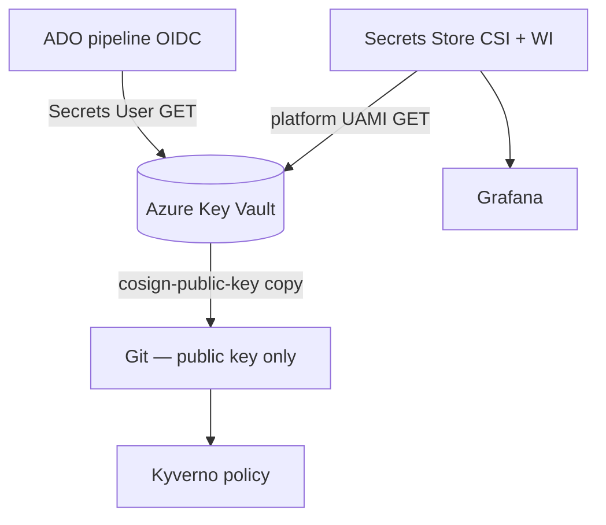

# Secrets management

How this project stores, delivers, and rotates secrets for the production-pilot test.

**Audience:** L2 implementer / operator
**Related:** [Topic 07 CSI setup](../setup/07-secrets-csi.md), [Topic 09 CI](../setup/09-ci-pipeline.md), [07-security-architecture.md](../architecture/07-security-architecture.md), [supply-chain.md](supply-chain.md), [SECURITY.md](../../SECURITY.md)

---

## Principles

1. **Never commit** private keys, passwords, or filled `terraform.tfvars` to Git.
2. **Azure Key Vault** is the system of record for platform secrets.
3. **Delivery** uses Workload Identity + Secrets Store CSI (or ADO OIDC for pipeline-only reads).
4. **Least privilege:** pipeline UAMI = Key Vault Secrets User + AcrPush; platform UAMI = Secrets User (+ DNS for cert-manager path).
5. Public material (cosign **public** key) may live in Git for Kyverno; private material must not.

---

## Secret inventory

| Secret | Store | Name / path | Consumers | Rotation trigger |
|--------|-------|-------------|-----------|------------------|
| Cosign private key | Key Vault | `cosign-private-key` | ADO mirror/sign job | Key compromise; annual test rotation |
| Cosign public key | Key Vault + Git | `cosign-public-key` · `policies/kyverno/cluster/02-verify-image-signatures.yaml` | Pipeline verify + Kyverno | With private key |
| Grafana admin | Key Vault → K8s Secret | typically `grafana-admin-credentials` (Topic 11) | Grafana | Password leak; admin change |
| CSI smoke test | Key Vault | `csi-test-secret` | `csi-test` pod | Test only; disposable |
| TLS certs | cert-manager → K8s Secrets | Ingress TLS secrets | NGINX | Auto-renew via DNS-01 |
| Terraform state | Azure Storage (bootstrap) | blob `dev.terraform.tfstate` | Operators with storage RBAC | Access revoke on offboarding |
| ADO auth | OIDC federation | Federated credential on pipeline UAMI | ADO service connection | Change SC subject → update federation |

**Not stored in KV (by design):** Boutique app “secrets” for the demo shop (mock payments). Do not add real card data.

---

## Delivery paths



| Path | When to use |
|------|-------------|
| **ADO OIDC → KV** | Ephemeral agent needs cosign private key during sign (Topic 09) |
| **CSI + Workload Identity** | Long-running pods need secrets at `/mnt/secrets` or synced K8s Secret (Topics 07, 11) |
| **Git** | Cosign **public** PEM only for admission policy |

---

## Local and Git hygiene

| Item | Rule |
|------|------|
| `*.tfvars` | Gitignored; commit `*.tfvars.example` only |
| `*.pem`, `*.key`, `cosign.key` | Gitignored |
| `.env*` | Gitignored |
| `tfplan` / `*.tfplan` | Gitignored |
| Docs / examples | Placeholders like `<KEY_VAULT_NAME>` — never paste real secrets |

Verify before push:

```bash
make pre-commit   # includes gitleaks
```

---

## Day-2 operations

### Rotate cosign keys (test)

1. Generate new key pair (empty password for test, or remembered password for pipeline).
2. `az keyvault secret set` for `cosign-private-key` and `cosign-public-key`.
3. Update Kyverno `02-verify-image-signatures.yaml` public PEM; commit + sync `kyverno-policies`.
4. Re-run ADO pipeline to re-sign digests (or plan digest re-promote).
5. Delete/disable old private key material in KV after validation.

Detail: [supply-chain.md](supply-chain.md) and [incident-response.md](../runbooks/incident-response.md).

### Rotate Grafana admin

1. Update secret in Key Vault (or recreate K8s secret per Topic 11).
2. Restart Grafana pods if the chart does not pick up CSI sync automatically.
3. Confirm login at `https://grafana-boutique.biroltilki.art`.

### Revoke human access

1. Remove Entra / Azure RBAC assignments (especially **Key Vault Administrator** on the test vault).
2. Rotate any secrets that person could have read (cosign private, Grafana).
3. Review ADO project membership and service connection administration.

---

## Test residual risks (accepted)

| Risk | Mitigation / note |
|------|-------------------|
| Key Vault public network (no ACL by default) | RBAC still required; enable firewall before shared-tenant use ([Security SEC-001](threat-model.md)) |
| Purge protection off | Allows teardown name reuse; soft-delete 7 days |
| Cosign private key on Microsoft-hosted agent disk during job | Ephemeral agent; scrub via job end; prefer rotate after public demo |
| Offline signing (`--tlog-upload=false`) | Documented ADR-0005; no Rekor transparency |

---

## Validation checklist

- [ ] `gitleaks` / `make pre-commit` clean
- [ ] No `cosign.key` or private PEM in Git history of current tree
- [ ] KV secrets `cosign-private-key` / `cosign-public-key` exist
- [ ] CSI test pod (Topic 07) mounted successfully at least once
- [ ] Pipeline signs without SP password variables (OIDC only)
- [ ] Kyverno public key matches KV public material

---

## References

- Setup: [07-secrets-csi.md](../setup/07-secrets-csi.md), [09-ci-pipeline.md](../setup/09-ci-pipeline.md), [11-observability.md](../setup/11-observability.md)
- Teardown KV purge: [teardown.md](../runbooks/teardown.md)
- ADR: [0005 cosign key-based signing](../adr/0005-cosign-key-based-signing.md)
