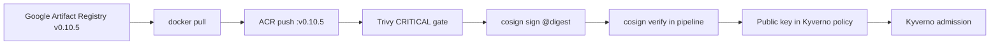

# Supply chain security

How this project secures container images from upstream mirror through cluster admission.

**Related:** [ADR-0005](../adr/0005-cosign-key-based-signing.md), [ADR-0009](../adr/0009-mirror-upstream-images.md), [07-security-architecture.md](../architecture/07-security-architecture.md)

---

## Scope

| Layer | Control | Implementation |
|-------|---------|----------------|
| Source | Pinned upstream version | Online Boutique **v0.10.5** from Google Artifact Registry |
| Registry | Private ACR | Mirror pipeline; Kyverno ACR allowlist |
| Build integrity | Not applicable | Images mirrored, not rebuilt in-repo |
| Vulnerability gate | Trivy CRITICAL | ADO pipeline fails on CRITICAL CVEs |
| Integrity / authenticity | cosign 2.2.4 | Sign by digest; `--tlog-upload=false` |
| Runtime enforcement | Kyverno 1.12 | `verifyImages`, deny `:latest`, pod security baseline |

---

## Mirror pipeline flow



**Pipeline files:** `pipelines/azure-pipelines.yml`, `pipelines/templates/build-scan-sign.yml`

**Authentication:** Azure DevOps OIDC → UAMI `uami-ado-pipeline` → AcrPush + Key Vault Secrets User (no long-lived CI secrets).

---

## Image inventory

Eleven services from [versions.yaml](../../versions.yaml):

`frontend`, `cartservice`, `checkoutservice`, `currencyservice`, `emailservice`, `paymentservice`, `productcatalogservice`, `recommendationservice`, `shippingservice`, `adservice`, `loadgenerator`

**Upstream:** `us-central1-docker.pkg.dev/google-samples/microservices-demo/<service>:v0.10.5`  
**Destination:** `<acr>.azurecr.io/<service>:v0.10.5` (signed at manifest digest)

---

## cosign key management

| Secret | Location | Used by |
|--------|----------|---------|
| `cosign-private-key` | Azure Key Vault | ADO pipeline (sign) |
| `cosign-public-key` | Azure Key Vault + Git (Kyverno policy) | Pipeline verify + Kyverno `verifyImages` |

**Generation (Topic 09):**

```bash
cosign generate-key-pair
az keyvault secret set --vault-name <KV> --name cosign-private-key --file cosign.key
az keyvault secret set --vault-name <KV> --name cosign-public-key --file cosign.pub
```

**Signing command (pipeline):**

```bash
cosign sign --key cosign.key --tlog-upload=false -y <acr>.azurecr.io/<service>@sha256:<digest>
```

**Verification (Kyverno):** `policies/kyverno/cluster/02-verify-image-signatures.yaml` with `ignoreTlog: true`, `ignoreSCT: true` (key-based, no Rekor).

### Key rotation

1. Generate new key pair; update Key Vault secrets.
2. Update Kyverno policy public key; sync Argo CD.
3. Re-run mirror pipeline to re-sign all images.
4. Roll workloads to new digests if needed.

---

## Trivy policy

| Setting | Value |
|---------|-------|
| Version | 0.51.4 |
| Severity gate | CRITICAL |
| Exit code | 1 on findings |
| Scan target | ACR image `@digest` after push |

HIGH/MEDIUM findings are visible in logs but do not fail the lab pipeline. Tighten for production pilots as needed.

---

## GitOps promotion

Signed digests are promoted to environment overlays via Git (immutable references):

| Environment | Mechanism | Template |
|-------------|-----------|----------|
| dev | Auto-sync after digest commit (Topic 10+) | `promote-digest.yml` (optional) |
| stage / prod | Manual Argo sync + ADO approval for prod | Topic 12 |

Artifact `digest-manifest.json` maps service name → `sha256:...` from each pipeline run.

---

## Threat considerations

| Threat | Mitigation |
|--------|------------|
| Unsigned image deploy | Kyverno `verifyImages` + ACR allowlist |
| `:latest` drift | Kyverno deny-latest-tag policy |
| Compromised CI secret | OIDC federation; cosign private key in KV only |
| Upstream registry swap | Fixed upstream path and tag in pipeline variables |
| CVE in base image | Trivy CRITICAL gate; monitor upstream releases |

**Residual risk:** Mirrored images trust Google's build; this project does not rebuild from source. Compromise of cosign private key allows signing malicious images until rotation.

---

## Operator checklist

- [ ] Pipeline green on `main` with all 11 services
- [ ] Kyverno policy contains live cosign public key (not placeholder)
- [ ] No cosign private key in Git, ADO variables, or logs
- [ ] ACR retention: teardown destroys images — re-run pipeline after rebuild ([13-teardown.md](../setup/13-teardown.md))

**Setup:** [09-ci-pipeline.md](../setup/09-ci-pipeline.md)  
**Troubleshooting:** [pipeline-failures.md](../troubleshooting/pipeline-failures.md), [image-signature.md](../troubleshooting/image-signature.md)
