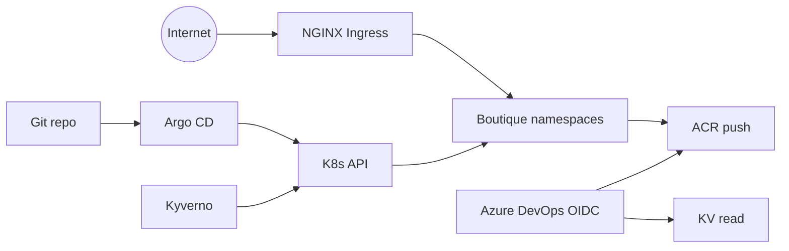

# Threat model — boutique-aks-devsecops

Production-pilot threat model for the **single-cluster** Online Boutique v0.10.5 platform. Complements [07-security-architecture.md](../architecture/07-security-architecture.md).

**Scope:** Azure AKS lab in `germanywestcentral` · dev/stage/prod namespaces · ADO CI · GitOps

---

## Assets

| Asset | Sensitivity | Location |
|-------|-------------|----------|
| Cosign private key | **Critical** | Key Vault |
| Grafana / Argo admin creds | High | K8s Secrets / KV |
| Signed container images | High | ACR |
| Git repository (manifests, policies) | High | Azure DevOps |
| Terraform state | High | Bootstrap storage blob |
| Application user traffic | Medium | Boutique ingress |
| Platform telemetry | Low | Prometheus / LAW |

---

## Trust boundaries

---

## STRIDE summary

| Threat | Example | Mitigation | Residual risk |
|--------|---------|------------|---------------|
| **Spoofing** | Fake ADO pipeline as Azure identity | OIDC federation subject lock (`sc://org/project/sc-name`) | Misconfigured federation |
| **Tampering** | Unsigned image deployed | cosign + Kyverno `verifyImages` | Policy bypass if Kyverno down |
| **Repudiation** | Who promoted prod? | ADO env approval audit + Git commits | No formal SIEM |
| **Information disclosure** | Secrets in Git | KV + CSI; `.gitignore` for tfvars/keys | Operator error |
| **Denial of service** | Crash Boutique / flood ingress | Resource limits; alerts | Single cluster no HA |
| **Elevation of privilege** | Privileged pod | Kyverno PSS baseline + deny privileged | Platform NS exclusions |

---

## Supply chain threats

| Threat | Control |
|--------|---------|
| Malicious upstream image | Pin v0.10.5; mirror to ACR; Trivy CRITICAL gate |
| Registry substitution | Kyverno ACR allowlist |
| `:latest` drift | Kyverno deny-latest |
| Unsigned image at runtime | cosign verify + Kyverno |
| Compromised cosign key | KV RBAC; rotation procedure in [supply-chain.md](supply-chain.md) |

---

## Identity threats

| Principal | Risk | Control |
|-----------|------|---------|
| ADO pipeline UAMI | Over-permissioned | AcrPush + KV Secrets User only |
| Platform UAMI | DNS zone takeover | DNS Zone Contributor scoped to `biroltilki.art` |
| Human operator | Long-lived PAT | Prefer OIDC; no PATs in repo |
| Workload pods | Access other tenants | Namespace isolation; NetworkPolicy deferred v1 |

---

## Out of scope (v1)

- Multi-region DR / active-active
- WAF / DDoS scrubbing
- HSM-backed cosign keys
- Formal penetration test
- SOC2 audit logging

---

## Review triggers

Revisit this model when:

- Enabling prod for external users beyond lab
- Adding external CI systems or registries
- Storing PII or payment data (Boutique demo uses mock payments)
- Connecting corporate Entra tenant policies

---

## References

- [SECURITY.md](../../SECURITY.md)
- [supply-chain.md](supply-chain.md)
- [secrets-management.md](secrets-management.md) (Topic 07)
- ADRs: [0003](../adr/0003-kyverno-admission.md), [0005](../adr/0005-cosign-key-based-signing.md), [0008](../adr/0008-ado-prod-approval-gate.md)
