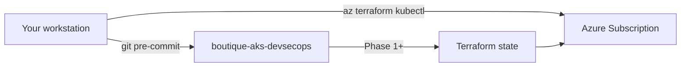

# Prerequisites

**Audience:** L2 — Implementer
**Last reviewed:** 2026-07-14
**Related:** [Setup index](README.md) · [ARCHITECTURE.md](../../ARCHITECTURE.md) · [versions.yaml](../../versions.yaml) · [ADR-0011](../adr/0011-aks-node-vm-sku.md)

---

## Purpose

Prepare your workstation and Azure access so every later setup topic runs without missing tools, wrong subscription context, or unavailable VM SKUs in **Germany West Central**.

When you finish this guide, you will have verified CLI versions, Azure login, node SKU availability for this subscription, a **GitHub remote** connected to your local clone, and a passing pre-commit run on the repository.

## When to use

Use this guide **once** before [01-terraform-bootstrap.md](01-terraform-bootstrap.md), and again when:

- Setting up a new laptop
- Switching Azure subscriptions
- Returning after a long break (re-run validation section only)

Do **not** use this guide for day-2 cluster operations — see [docs/operations/](../operations/) and [docs/runbooks/](../runbooks/).

## Prerequisites

- macOS, Linux, or WSL2 on Windows
- Internet access for package installs and Azure CLI login
- An Azure subscription where you can create resource groups (Owner or Contributor)
- Rights to register Azure DNS and create AKS resources (validated in later topics)
- Git installed
- A **GitHub account** with permission to create repositories (or access to an existing org repo)
- This project directory on your machine (cloned from GitHub **or** copied locally — Step 4 connects Git either way)

**Required knowledge:** basic shell, Git, and cloud CLI usage. No prior AKS experience required.

**Version control:** **GitHub** is the sole Git remote for this project (local clone, Argo CD, and ADO pipelines). Azure DevOps is used for **CI/CD and OIDC only** — not Azure Repos.

**Git remote note:** All GitOps manifests, Argo CD Applications, and pipeline checkout use **GitHub**. Connect your repository in Topic 00 Step 4; patch `<GITHUB_ORG>` / `<REPO_NAME>` in GitOps YAML during Topics 05–12. Azure DevOps (Topics 04, 09) connects to the **same GitHub repo** for pipeline runs and digest promotion pushes.

## Architecture context

This project provisions a single AKS platform in `germanywestcentral` with node pools **Standard_D2s_v6** (system) and **Standard_D4s_v6** (user). Tool versions are pinned in [versions.yaml](../../versions.yaml) so Terraform, Kubernetes, and pipeline stages stay compatible.



**Prose:** Your machine is the control plane for all implementation. Nothing in this project assumes a pre-provisioned cluster — you build it step-by-step from Phase 1 onward.

---

## Step-by-step implementation

### Step 1: Install core CLI tools

**Goal:** Install Terraform, Azure CLI, kubectl, Helm, Git, Python 3, and pre-commit at minimum supported versions.

**Why:** Later phases run `terraform apply`, `az aks get-credentials`, `helm`, and pre-commit hooks. Version skew causes provider and API errors.

**Where:** Your local machine (not Azure Cloud Shell for day-to-day work).

#### macOS (Homebrew)

```bash
brew install terraform azure-cli kubectl helm git python@3.12 pre-commit
```

#### Linux (apt example — adjust for your distro)

```bash
sudo apt-get update
sudo apt-get install -y git python3 python3-pip curl
curl -sL https://aka.ms/InstallAzureCLIDeb | sudo bash
# Install Terraform from HashiCorp repo per https://developer.hashicorp.com/terraform/install
pip install pre-commit
```

#### Verify versions

```bash
terraform version
az version
kubectl version --client
helm version
git --version
python3 --version
pre-commit --version
```

**Expected output:** Each command prints a version. Minimums from [versions.yaml](../../versions.yaml):

| Tool | Minimum |
|------|---------|
| Terraform | >= 1.6.0 |
| kubectl client | 1.34+ (within 1 minor of AKS — see `versions.yaml`) |
| Helm | 3.14+ |
| Python | 3.10+ |
| pre-commit | 3.0+ |

**Validation:**

- [ ] `terraform version` shows `>= 1.6`
- [ ] `kubectl version --client` shows 1.34 or higher (or within one minor of `versions.yaml`)
- [ ] All commands exit with code 0

---

### Step 2: Authenticate to Azure and select subscription

**Goal:** Log in to Azure CLI and set the subscription used for the entire project.

**Why:** Every `az` and Terraform command targets one subscription. Wrong subscription causes resources in the wrong tenant or billing scope.

**Where:** Local machine.

```bash
az login
az account list --output table
az account set --subscription "<AZURE_SUBSCRIPTION_ID>"
az account show --output table
```

Replace `<AZURE_SUBSCRIPTION_ID>` with your subscription GUID from `az account list`.

**Expected output:** `az account show` displays the chosen subscription name and `IsDefault: True`.

**Validation:**

```bash
az account show --query "{name:name, id:id, tenantId:tenantId}" -o json
```

- [ ] Subscription ID matches the one you intend to bill
- [ ] You have Contributor or Owner on this subscription (check Azure Portal → Subscriptions → Access control)

**Common problems:**

| Symptom | Fix |
|---------|-----|
| `az login` opens browser but fails | Clear cache: `az account clear` then retry |
| Subscription not listed | Sign in with the correct Entra tenant; ask admin for access |
| `AuthorizationFailed` later | Confirm RBAC role on subscription or resource group |

---

### Step 3: Verify VM SKU availability in Germany West Central

**Goal:** Confirm **Standard_D4s_v6** (user pool) is available for your subscription in `germanywestcentral`.

**Why:** AKS node pool creation fails if the SKU is restricted or capacity-blocked. This check avoids a failed Phase 3 apply. See [ADR-0011](../adr/0011-aks-node-vm-sku.md).

**Where:** Local machine (requires Step 2 complete).

```bash
az vm list-skus --location germanywestcentral --size Standard_D4s_v6 --all -o table
az vm list-skus --location germanywestcentral --size Standard_D2s_v6 --all -o table
```

**Expected output:** Rows with `Restrictions` column empty or showing `None`:

```text
ResourceType     Locations           Name             Zones    Restrictions
---------------  ------------------  ---------------  -------  --------------
virtualMachines  GermanyWestCentral  Standard_D4s_v6  1,2,3    None
```

**Validation:**

- [ ] Both D4s_v6 and D2s_v6 show no `NotAvailableForSubscription` restriction
- [ ] If restricted, do **not** proceed to Phase 3 without choosing a fallback SKU documented in ADR-0011

**Recovery:** If `westeurope` or other regions show restrictions but `germanywestcentral` is clear, keep the locked region — do not change without updating `versions.yaml` and ADR-0011.

---

### Step 4: Connect local project to GitHub

**Goal:** Ensure the project is a Git repository with `origin` pointing at a GitHub remote and an initial commit on branch `main`.

**Why:** Pre-commit hooks (Step 5), PR workflow, and later GitOps topics assume version-controlled files with a pushable remote. Without Git + remote, `pre-commit install` fails and Topics 05–12 cannot sync manifests from Git.

**Where:** Local machine (repository root) + GitHub (browser or `gh` CLI).

Replace placeholders:

| Placeholder | Meaning | Example |
|-------------|---------|---------|
| `<GITHUB_ORG>` | Your GitHub user or organization | `biroltilki` |
| `<REPO_NAME>` | Repository name | `boutique-aks-devsecops` |
| `<GITHUB_REPO_URL>` | HTTPS clone URL | `https://github.com/biroltilki/boutique-aks-devsecops.git` |

#### Step 4.1: Choose your path

| Situation | Path |
|-----------|------|
| Empty folder — want fresh clone | **Path A** — Clone from GitHub |
| Project files already on disk (no `.git`) | **Path B** — Init local + create GitHub repo + push |
| Already cloned with working `origin` | **Path C** — Verify only |

---

#### Path A — Clone from an existing GitHub repository

Use when the repo already exists on GitHub (yours or a fork).

```bash
cd ~/Documents/Cursor   # or your preferred parent directory
git clone https://github.com/<GITHUB_ORG>/<REPO_NAME>.git
cd <REPO_NAME>
git status
git remote -v
git branch --show-current
```

**Expected:** `origin` URL matches your GitHub repo; branch is `main` (or checkout `main`: `git checkout main`).

---

#### Path B — Local project exists; create GitHub repo and connect

Use when you already have project files locally (typical workshop flow) but no Git remote yet.

**B.1 — Verify local directory**

```bash
cd /path/to/boutique-aks-devsecops
ls README.md docs/setup/00-prerequisites.md versions.yaml
git status
```

If `git status` prints `fatal: not a git repository`, initialize Git:

```bash
git init -b main
git status
```

**B.2 — Create empty GitHub repository (GUI)**

1. Sign in to [GitHub](https://github.com)
2. Click **+** (top right) → **New repository**
3. **Owner:** `<GITHUB_ORG>`
4. **Repository name:** `<REPO_NAME>` (e.g. `boutique-aks-devsecops`)
5. **Description:** (optional) `Azure AKS DevSecOps reference platform`
6. **Visibility:** **Private** recommended (lab configs; no secrets in Git, but reduces exposure)
7. **Do not** initialize with README, `.gitignore`, or license — your local tree already has these files
8. Click **Create repository**
9. Copy the **HTTPS** URL shown (e.g. `https://github.com/<GITHUB_ORG>/<REPO_NAME>.git`)

**B.3 — Connect remote and push**

```bash
cd /path/to/boutique-aks-devsecops

# Confirm secrets are not staged
git status
# terraform.tfvars must NOT appear — it is gitignored

git remote add origin https://github.com/<GITHUB_ORG>/<REPO_NAME>.git
# If origin already exists with wrong URL: git remote set-url origin <GITHUB_REPO_URL>

git add .
git status
# Review: no terraform.tfvars, no *.pem, no .env files

git commit -m "chore: initial commit — boutique-aks-devsecops scaffold"
git push -u origin main
```

**Authentication:** GitHub no longer accepts account passwords for HTTPS push. Use one of:

- **GitHub CLI** (recommended): `gh auth login` then push
- **Personal Access Token (PAT):** create at GitHub → Settings → Developer settings → Fine-grained token (Contents: Read and write)
- **SSH:** `git remote set-url origin git@github.com:<GITHUB_ORG>/<REPO_NAME>.git` and use an SSH key

**B.4 — Optional: create repo via GitHub CLI**

If [`gh`](https://cli.github.com/) is installed and authenticated:

```bash
cd /path/to/boutique-aks-devsecops
gh auth login
gh repo create <REPO_NAME> --private --source=. --remote=origin --push
```

Skip B.2–B.3 if this succeeds.

---

#### Path C — Verify existing clone

```bash
cd /path/to/boutique-aks-devsecops
git status
git remote -v
git branch --show-current
git log -1 --oneline
```

**Expected:**

```text
origin  https://github.com/<GITHUB_ORG>/<REPO_NAME>.git (fetch)
origin  https://github.com/<GITHUB_ORG>/<REPO_NAME>.git (push)
main
```

---

#### Step 4 validation

```bash
git remote get-url origin
git status
git branch --show-current
```

- [ ] `git status` works (not `fatal: not a git repository`)
- [ ] `origin` points to your GitHub HTTPS or SSH URL
- [ ] Branch is `main`
- [ ] At least one commit exists locally (`git log -1`)
- [ ] `git push origin main` succeeds (Path B) or repo is up to date (Path A/C)
- [ ] GitHub web UI shows repository files (README, `docs/setup/`, `terraform/`)

**Common problems:**

| Symptom | Fix |
|---------|-----|
| `fatal: not a git repository` | Path B: run `git init -b main` |
| `remote origin already exists` | `git remote -v` — use `set-url` if wrong |
| `Support for password authentication was removed` | Use PAT, `gh auth login`, or SSH |
| `terraform.tfvars` in `git status` | Do not commit — verify `.gitignore`; `git reset HEAD terraform.tfvars` |
| Large file rejected on push | Check `check-added-large-files` limit; remove binaries from commit |
| Empty GitHub repo has README from template | Delete GitHub README or merge; prefer Path B step 7 (empty repo) |

---

### Step 5: Install pre-commit hooks

**Goal:** Install Git hooks so commits run gitleaks, Terraform fmt, and YAML lint automatically.

**Why:** Catches secrets and formatting issues before PR review — aligned with project security baseline. Requires Step 4 complete (`.git/` must exist).

**Where:** Local machine, repository root.

```bash
cd /path/to/boutique-aks-devsecops
pre-commit install
pre-commit run --all-files
```

**Expected output:** Hooks run; `terraform_validate` should pass on existing modules. `gitleaks`, `trailing-whitespace`, and `yamllint` should pass on existing docs.

**Validation:**

- [ ] `pre-commit install` prints `pre-commit installed at .git/hooks/pre-commit`
- [ ] `pre-commit run --all-files` completes without unexpected failures

**Common problems:**

| Symptom | Fix |
|---------|-----|
| `pre-commit install` fails — not a git repo | Complete Step 4 first |
| `terraform validate` fails | Paste error — may need `terraform init` in module dirs |
| `yamllint` errors | Fix reported line numbers or run from repo root |
| `gitleaks` false positive | Review match; never commit real secrets to verify |

---

### Step 6: Install optional tools (recommended before Phase 8–9)

**Goal:** Pre-install tools used later so pipeline and policy phases are not blocked.

**Why:** Not required for Phase 1, but installing early avoids mid-project context switching.

**Where:** Local machine.

| Tool | Used in | Install hint |
|------|---------|--------------|
| cosign 2.2.4 | Phase 9 sign/verify | `brew install cosign` or [sigstore releases](https://github.com/sigstore/cosign/releases) |
| Trivy 0.51.x | Phase 9 scan | `brew install trivy` |
| kustomize | Phase 10 overlays | `brew install kustomize` |
| Kyverno CLI | Phase 8 policy tests | `brew install kyverno` |

```bash
cosign version
trivy --version
kustomize version
kyverno version
```

**Validation:** Optional at Phase 0 — record which tools you installed for later.

---

## Validation (end-to-end)

Run this checklist before starting [01-terraform-bootstrap.md](01-terraform-bootstrap.md):

```bash
terraform version
az account show --query name -o tsv
az vm list-skus --location germanywestcentral --size Standard_D4s_v6 --all -o table | head -5
git remote -v
git status
pre-commit run --all-files
```

- [ ] All core CLI tools meet minimum versions
- [ ] Correct Azure subscription selected
- [ ] VM SKUs available in `germanywestcentral`
- [ ] GitHub `origin` configured; `main` branch pushed
- [ ] Pre-commit hooks installed and passing
- [ ] You have read [ARCHITECTURE.md](../../ARCHITECTURE.md) executive summary and [ROADMAP.md](../../ROADMAP.md) phase overview

---

## Troubleshooting

| Symptom | Likely cause | Fix |
|---------|--------------|-----|
| `az: command not found` | CLI not installed or not on PATH | Reinstall Azure CLI; restart shell |
| `kubectl` connects to wrong cluster | Old kubeconfig context | Phase 3 sets correct context; for now `kubectl config get-contexts` |
| SKU list empty | Wrong region name | Use `germanywestcentral` exactly (no spaces) |
| SKU `NotAvailableForSubscription` | Regional/subscription quota | Try ADR-0011 fallbacks; request quota increase in Azure Portal |
| pre-commit hook fails on `terraform validate` | Provider plugins not initialized | Run `terraform init` in failing module dir; paste error if persists |
| `git push` rejected (403/401) | GitHub auth | `gh auth login` or configure PAT / SSH key |
| `origin` missing | Step 4 skipped | `git remote add origin <GITHUB_REPO_URL>` |
| `az login` tenant mismatch | Multiple Entra tenants | `az login --tenant <TENANT_ID>` |

---

## Common mistakes

- **Using Azure Cloud Shell as the only environment** — acceptable for quick tests, but store Terraform state and kubeconfig workflow on your primary machine for consistency.
- **Skipping SKU check** — Phase 3 `terraform apply` fails late with allocation errors.
- **Committing `terraform.tfvars` with secrets** — use `*.tfvars.example` only; real values stay local or in CI variables/OIDC.
- **Skipping GitHub remote setup** — pre-commit and GitOps topics fail without `.git` and a pushable remote.
- **Initializing GitHub repo with README** when local files exist — causes unrelated histories on first push; create an **empty** repo (Path B).
- **Wrong region** — all resources must stay in `germanywestcentral` unless ADR-0011 is formally updated.

---

## Best practices

- Pin your active subscription in a shell profile alias to avoid accidental cross-subscription applies.
- Re-run Step 3 SKU check if Azure reports capacity issues in your region.
- Run `pre-commit run --all-files` before every PR.
- Keep [versions.yaml](../../versions.yaml) open when installing tools so versions match the project.

---

## Production considerations

This lab uses a **single** AKS cluster and minimal node counts. Prerequisites here do not configure HA — that is an explicit non-goal. Before any shared/production-like usage:

- Use separate Azure subscriptions for lab vs production
- Enable MFA on Entra accounts with subscription access
- Document who holds Owner on the subscription

N/A for multi-region or multi-cluster — out of scope.

---

## Security considerations

- Never paste client secrets, cosign private keys, or `terraform.tfvars` contents into issues or chat.
- `az login` stores credentials locally — lock your workstation; use `az account clear` on shared machines.
- pre-commit **gitleaks** scans for accidental secret commits — do not disable without cause.
- Use least privilege: Contributor on a dedicated resource group is sufficient once Phase 2 creates it; subscription Owner is only needed for initial lab setup.

---

## Further reading

- [Azure CLI install](https://learn.microsoft.com/en-us/cli/azure/install-azure-cli)
- [Terraform install](https://developer.hashicorp.com/terraform/install)
- [pre-commit](https://pre-commit.com/)
- [GitHub: Creating a new repository](https://docs.github.com/en/repositories/creating-and-managing-repositories/creating-a-new-repository)
- [GitHub CLI (`gh`)](https://cli.github.com/)
- [ADR-0011: AKS node VM SKUs and region](../adr/0011-aks-node-vm-sku.md)
- [Architecture: requirements](../architecture/01-requirements.md)

---

## Next step

After you confirm the end-to-end validation checklist, proceed to **[01-terraform-bootstrap.md](01-terraform-bootstrap.md)** (Phase 1) when that topic is authored and you are ready to create remote Terraform state.

Do not start Phase 1 until you explicitly confirm Phase 0 validation in the workshop.
