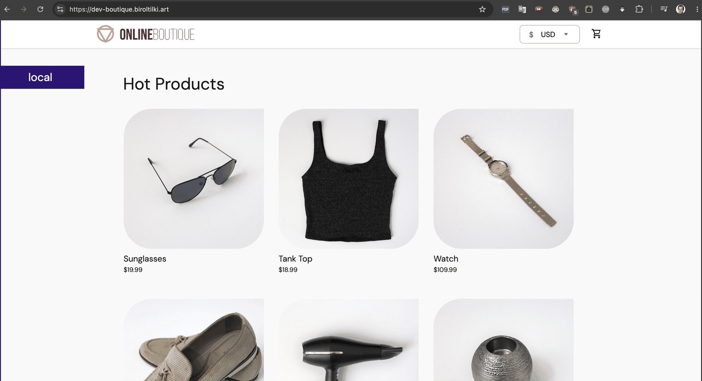
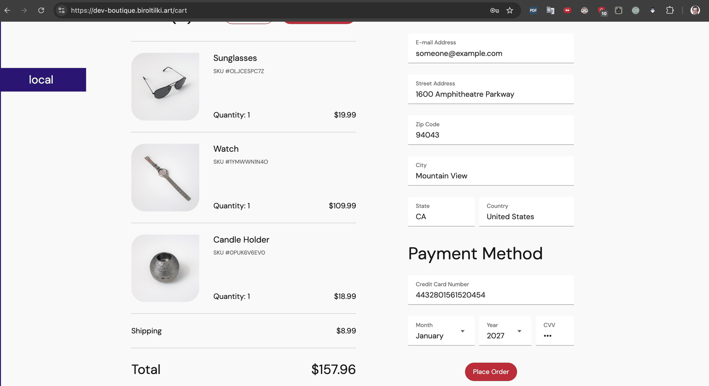

# 10 — Boutique Dev Deploy

**Audience:** L2 — Implementer
**Estimated time:** 90 minutes
**Prerequisites:** [06-ingress-tls.md](06-ingress-tls.md) ✅ · [08-admission-policies.md](08-admission-policies.md) ✅ · [09-ci-pipeline.md](09-ci-pipeline.md) ✅
**Creates:** Online Boutique v0.10.5 in `boutique-dev`, HTTPS ingress at `dev-boutique.biroltilki.art`
**Related ADRs:** [0002](../adr/0002-single-cluster-multi-namespace.md), [0009](../adr/0009-mirror-upstream-images.md)

---

## Topic goal

When this topic is complete, **Online Boutique v0.10.5** runs in namespace **`boutique-dev`**, deployed by **Argo CD** (auto-sync), with all workload images from **signed ACR** references. The storefront is reachable at **`https://dev-boutique.biroltilki.art`** and passes the dev smoke test.

## Why this topic is required

This is the first end-to-end proof that supply chain (mirror → sign), admission (Kyverno), ingress/TLS, and GitOps work together. Stage and prod overlays build on the same base in Topic 12.

---

## Before you begin

- [ ] Topic 09: 11 Boutique images signed in ACR; Kyverno public key updated
- [ ] Topic 06: NGINX ingress + cert-manager healthy; DNS works for `*.biroltilki.art`
- [ ] Topic 08: Kyverno policies synced; `<ACR_NAME>` placeholders replaced
- [ ] GitHub remote matches Argo CD `repoURL` placeholders (`<GITHUB_ORG>` / `<REPO_NAME>`)

```bash
cd terraform/environments/dev
terraform output -raw acr_login_server
terraform output -raw acr_name
kubectl get pods -n kyverno
kubectl get pods -n ingress-nginx
argocd app list 2>/dev/null | grep -E 'apps-root|boutique' || kubectl get applications -n argocd
```

---

## Step 10.1: Review GitOps layout

### Goal

Understand base + dev overlay structure and Argo CD Application wiring.

### Why this step is required

Image refs and ingress host must match your ACR and DNS before sync.

### Commands

```bash
cd /path/to/boutique-aks-devsecops
tree gitops/apps/boutique -L 3
cat gitops/apps/boutique/dev-application.yaml
cat gitops/apps/boutique/overlays/dev/kustomization.yaml
```

### Expected layout

| Path | Purpose |
|------|---------|
| `base/manifests.yaml` | Upstream v0.10.5 release manifests |
| `base/kustomization.yaml` | ACR image transforms + remove `frontend-external` LB |
| `overlays/dev/` | Namespace, ingress, dev patches |
| `dev-application.yaml` | Argo CD app with **automated** sync |

### Validation

- [ ] `dev-boutique.biroltilki.art` in `overlays/dev/ingress.yaml`
- [ ] `boutique-dev` namespace in overlay

---

## Step 10.2: Mirror and sign auxiliary images (redis, busybox)

### Goal

Push **redis** and **busybox** to ACR with pinned tags and cosign signatures.

### Why this step is required

Upstream Boutique uses `redis:alpine` and `busybox:latest` (init container). Kyverno requires **ACR-only**, **no `:latest`**, and **cosign signatures** in `boutique-dev`.

### Commands

```bash
ACR_NAME="$(cd terraform/environments/dev && terraform output -raw acr_name)"
ACR_LOGIN="$(cd terraform/environments/dev && terraform output -raw acr_login_server)"
KV_NAME="$(cd terraform/environments/dev && terraform output -raw key_vault_name)"

az acr login --name "${ACR_NAME}"

# Redis (replaces redis:alpine in manifests)
docker pull redis:7.2-alpine
docker tag redis:7.2-alpine "${ACR_LOGIN}/redis:7.2-alpine"
docker push "${ACR_LOGIN}/redis:7.2-alpine"

# Busybox (replaces busybox:latest in loadgenerator init)
docker pull busybox:1.36.1
docker tag busybox:1.36.1 "${ACR_LOGIN}/busybox:1.36.1"
docker push "${ACR_LOGIN}/busybox:1.36.1"

# Sign by digest (same cosign key as Topic 09)
COSIGN_KEY="$(mktemp)"
az keyvault secret show --vault-name "${KV_NAME}" --name cosign-private-key --query value -o tsv > "${COSIGN_KEY}"
chmod 600 "${COSIGN_KEY}"

for REPO in redis busybox; do
  TAG=$([[ "${REPO}" == redis ]] && echo "7.2-alpine" || echo "1.36.1")
  DIGEST="$(az acr repository show-manifests --name "${ACR_NAME}" --repository "${REPO}" \
    --query "[?contains(tags, '${TAG}')].digest | [0]" -o tsv)"
  cosign sign --key "${COSIGN_KEY}" --tlog-upload=false -y "${ACR_LOGIN}/${REPO}@${DIGEST}"
done
rm -f "${COSIGN_KEY}"
```

### Validation

```bash
az acr repository list --name "${ACR_NAME}" -o table | grep -E 'redis|busybox'
```

- [ ] `redis:7.2-alpine` and `busybox:1.36.1` exist in ACR
- [ ] Both signed (cosign verify succeeds)

---

## Step 10.3: Patch placeholders and push Git

### Goal

Replace `<ACR_LOGIN_SERVER>`, GitHub `repoURL`, and verify kustomize output.

### Why this step is required

Argo CD and Kyverno reject invalid image registry paths.

### Commands

```bash
ACR_LOGIN="$(cd terraform/environments/dev && terraform output -raw acr_login_server)"

# Replace ACR placeholder in kustomize files
grep -rl '<ACR_LOGIN_SERVER>' gitops/apps/boutique/ | while read -r f; do
  sed -i.bak "s|<ACR_LOGIN_SERVER>|${ACR_LOGIN}|g" "$f" && rm -f "$f.bak"
done

# Set GitHub repoURL in dev-application.yaml (match Topic 05 pattern)
# Edit gitops/apps/boutique/dev-application.yaml — set <GITHUB_ORG> and <REPO_NAME>

# Optional: validate rendered manifests
kustomize build gitops/apps/boutique/overlays/dev | grep 'image:' | head -15
```

Confirm images reference `${ACR_LOGIN}/...` with tags `v0.10.5`, `7.2-alpine`, `1.36.1`.

Commit and push:

```bash
git add gitops/apps/
git commit -m "feat(boutique): add dev overlay and Argo CD application"
git push origin main
```

### Validation

- [ ] No `<ACR_LOGIN_SERVER>`, `<GITHUB_ORG>`, or `<REPO_NAME>` literals remain
- [ ] Changes pushed to branch Argo CD tracks (`main`)

---

## Step 10.4: Sync Argo CD applications

### Goal

Deploy Boutique dev via GitOps (`apps-root` → `boutique-dev`).

### Why this step is required

Manual `kubectl apply` bypasses the GitOps model used for promotion in Topic 12.

### Commands

```bash
# Refresh root apps (if using Argo CD CLI)
argocd app sync apps-root --prune 2>/dev/null || true
argocd app sync boutique-dev --prune 2>/dev/null || true

# Or kubectl — wait for Application resource
kubectl get application -n argocd boutique-dev
kubectl describe application -n argocd boutique-dev | tail -20
```

**GUI:** Argo CD → **apps-root** → Sync → then **boutique-dev** → Sync.

Watch sync:

```bash
watch -n5 'kubectl get application -n argocd boutique-dev; kubectl get pods -n boutique-dev'
```

### Expected output

- `boutique-dev` Application: **Synced** / **Healthy**
- Pods transition to **Running** (11 Boutique + redis-cart + loadgenerator)

### Validation

```bash
kubectl get pods -n boutique-dev
kubectl get ingress -n boutique-dev
```

- [ ] All application pods Running (allow 3–8 min for image pull)
- [ ] Ingress `boutique-frontend` has ADDRESS (ingress controller IP)

---

## Step 10.5: DNS and TLS for dev hostname

### Goal

Confirm `dev-boutique.biroltilki.art` resolves and certificate becomes Ready.

### Why this step is required

Smoke test uses HTTPS; cert-manager issues cert after DNS points to ingress.

### Commands

```bash
INGRESS_IP="$(kubectl get svc -n ingress-nginx ingress-nginx-controller -o jsonpath='{.status.loadBalancer.ingress[0].ip}')"
echo "Ingress IP: ${INGRESS_IP}"

dig +short dev-boutique.biroltilki.art

kubectl get certificate -n boutique-dev 2>/dev/null || kubectl get certificate -A | grep boutique
kubectl describe certificate -n boutique-dev boutique-dev-tls 2>/dev/null | tail -15
```

If DNS record missing, create **A record** in Azure DNS:

```bash
RG="$(cd terraform/environments/dev && terraform output -raw resource_group_name)"
az network dns record-set a add-record \
  --resource-group "${RG}" \
  --zone-name biroltilki.art \
  --record-set-name dev-boutique \
  --ipv4-address "${INGRESS_IP}"
```

### Validation

- [ ] `dig dev-boutique.biroltilki.art` returns ingress IP
- [ ] Certificate `Ready=True` (may take 2–10 min after DNS)

---

## Step 10.6: Run dev smoke test

### Goal

Verify frontend health endpoint and basic page load.

### Why this step is required

Confirms ingress routing, TLS, and microservice mesh are functional.

### Commands

```bash
chmod +x tests/integration/dev-smoke.sh
./tests/integration/dev-smoke.sh
```

Manual check:

```bash
curl -v "https://dev-boutique.biroltilki.art/_healthz" \
  -H "Cookie: shop_session-id=manual-test"
```

### Expected output

```text
OK: /_healthz returned 200
PASS: Boutique dev smoke test succeeded
```

### Validation

- [ ] Smoke script exits 0
- [ ] Browser loads `https://dev-boutique.biroltilki.art` with product catalog

---

## Step 10.7: (Optional) Pin image digests from pipeline

### Goal

Use immutable `@sha256` digests from Topic 09 `digest-manifest` artifact.

### Why this step is required

Digest pins survive tag overwrites and match promotion flow in Topic 12.

### Commands

Download `digest-manifest.json` from latest green ADO pipeline run.

Add to `gitops/apps/boutique/overlays/dev/kustomization.yaml`:

```yaml
images:
  - name: <acr>.azurecr.io/frontend
    digest: sha256:<from-manifest>
  # ... repeat per service
```

Or enable promote stage in `pipelines/azure-pipelines.yml` (Topic 09 optional block).

Push and let Argo CD auto-sync.

### Validation

- [ ] `kubectl get deploy -n boutique-dev frontend -o jsonpath='{.spec.template.spec.containers[0].image}'` shows `@sha256:`

---

## Troubleshooting

| Symptom | Likely cause | Guide |
|---------|--------------|-------|
| Pods `ImagePullBackOff` | Wrong ACR name or missing image | [pipeline-failures.md](../troubleshooting/pipeline-failures.md) |
| Kyverno blocks pods | Unsigned image or non-ACR ref | [kyverno-admission.md](../troubleshooting/kyverno-admission.md) |
| `verify-image-signatures` deny | Missing redis/busybox sign | Step 10.2 |
| Argo sync failed | Invalid kustomize or repo URL | [argocd-sync.md](../troubleshooting/argocd-sync.md) |
| Certificate not Ready | DNS not pointing to ingress | [cert-manager-dns01.md](../troubleshooting/cert-manager-dns01.md) |
| 502 / connection refused | Pods not ready | `kubectl logs -n boutique-dev deploy/frontend` |

---

## Topic complete checklist

- [ ] Auxiliary images `redis` and `busybox` mirrored, signed in ACR
- [ ] `<ACR_LOGIN_SERVER>` and GitHub `repoURL` patched; pushed to `main`
- [ ] Argo CD `boutique-dev` Synced and Healthy
- [ ] DNS A record for `dev-boutique.biroltilki.art`
- [ ] TLS certificate Ready
- [ ] `tests/integration/dev-smoke.sh` passes

**Screenshot references:**

Dev storefront (`https://dev-boutique.biroltilki.art`):



Dev cart / checkout:



---

## Next step

**Topic 11 — Observability:** kube-prometheus-stack, Grafana ingress, Boutique dashboards, SLO alerts.

Guide: [11-observability.md](11-observability.md)

Topic 10 is complete — continue to Topic 11 when ready.

**Lab note:** Capacity-constrained labs may run a slim Boutique (core storefront only; optional services at 0 replicas). See overlay patches under `gitops/apps/boutique/overlays/*/patches/`.
