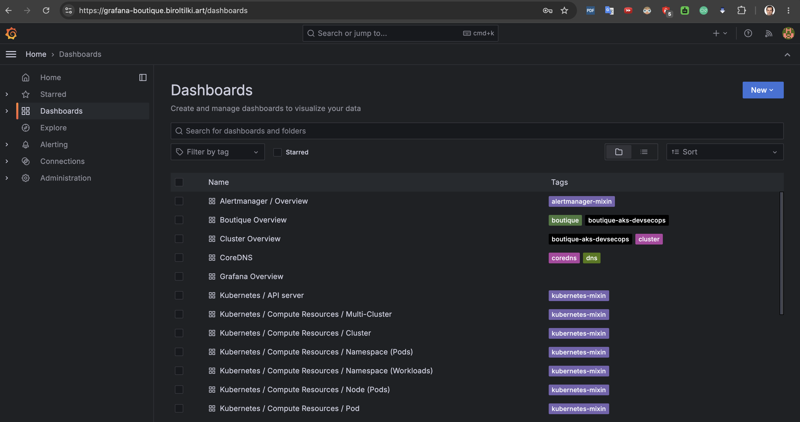
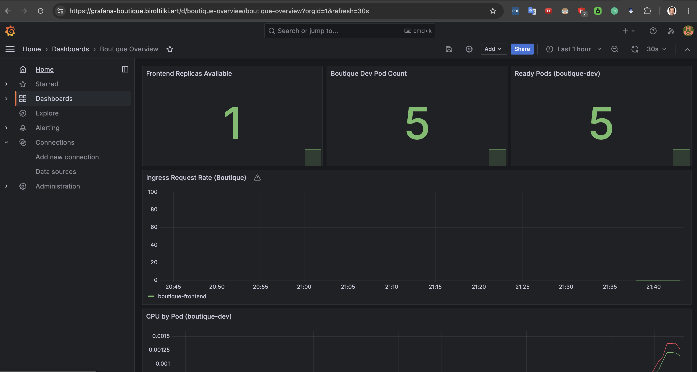
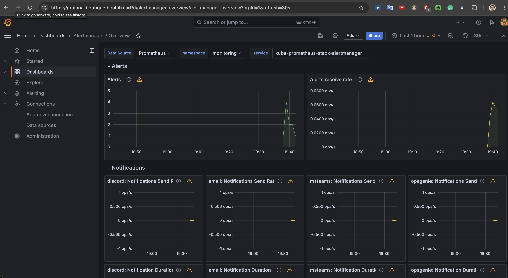

# 11 — Observability

**Audience:** L2 — Implementer
**Estimated time:** 90 minutes
**Prerequisites:** [05-gitops-bootstrap.md](05-gitops-bootstrap.md) ✅ · [06-ingress-tls.md](06-ingress-tls.md) ✅ · [10-boutique-dev.md](10-boutique-dev.md) ✅
**Creates:** kube-prometheus-stack, Loki, Promtail, Grafana ingress, dashboards, alerts, OTel collector
**Related docs:** [10-observability.md](../architecture/10-observability.md), [ADR-0012](../adr/0012-loki-in-cluster-logging.md), [boutique-availability.md](../slo/boutique-availability.md)

---

## Topic goal

When this topic is complete, **Prometheus**, **Grafana**, and **Alertmanager** run in namespace **`monitoring`**, **Loki** and **Promtail** aggregate pod logs, Grafana is reachable at **`https://grafana-boutique.biroltilki.art`**, **Cluster Overview** and **Boutique Overview** dashboards load, platform/Boutique **PrometheusRules** are active, and the **OpenTelemetry Collector** accepts OTLP traces (10% sampling).

## Why this topic is required

Operating a DevSecOps platform requires visibility into cluster health, ingress traffic, and Boutique availability before stage/prod promotion (Topic 12). SLO documentation and alerts define when to pause promotions.

---

## Before you begin

- [ ] Topic 10: Boutique dev healthy (`./tests/integration/dev-smoke.sh` passes)
- [ ] Topic 06: Ingress IP and cert-manager working
- [ ] Argo CD `monitoring` AppProject exists (`gitops/projects/monitoring.yaml`)
- [ ] Optional: Key Vault access for Grafana admin password (Topic 07 pattern)

```bash
kubectl get appproject -n argocd monitoring
kubectl get pods -n boutique-dev -l app=frontend
kubectl get svc -n ingress-nginx ingress-nginx-controller -o jsonpath='{.status.loadBalancer.ingress[0].ip}'
```

---

## Step 11.1: Review monitoring GitOps layout

### Goal

Understand components delivered under `gitops/platform/monitoring/`.

### Why this step is required

Multiple Argo CD Applications and CRDs sync in waves; order matters.

### Commands

```bash
cd /path/to/boutique-aks-devsecops
tree gitops/platform/monitoring -L 3
cat gitops/platform/monitoring/kustomization.yaml
cat versions.yaml | grep -E 'kube_prometheus|opentelemetry|loki|promtail'
```

### Expected layout

| Component | Chart / version | Sync wave |
|-----------|-----------------|-----------|
| Loki | 6.23.0 | 38 |
| Promtail | 6.16.6 | 39 |
| kube-prometheus-stack | 58.2.2 | 40 |
| otel-collector | 0.95.0 | 41 |
| PrometheusRules / ServiceMonitors | CRDs | 45 |
| Grafana dashboards | ConfigMaps | with platform-root |

### Validation

- [ ] `grafana-boutique.biroltilki.art` in `kube-prometheus-stack/values.yaml`
- [ ] Prometheus retention `15d`

---

## Step 11.2: Create Grafana admin credentials

### Goal

Provision Kubernetes Secret referenced by Grafana Helm values.

### Why this step is required

Grafana chart uses `existingSecret: grafana-admin-credentials` — no default password in Git.

### Commands

**Option A — Key Vault sourced (recommended):**

```bash
KV_NAME="$(cd terraform/environments/dev && terraform output -raw key_vault_name)"
GRAFANA_PASS="$(openssl rand -base64 24)"

az keyvault secret set --vault-name "${KV_NAME}" \
  --name grafana-admin-password --value "${GRAFANA_PASS}"

kubectl create namespace monitoring --dry-run=client -o yaml | kubectl apply -f -

kubectl create secret generic grafana-admin-credentials -n monitoring \
  --from-literal=admin-user=admin \
  --from-literal=admin-password="${GRAFANA_PASS}" \
  --dry-run=client -o yaml | kubectl apply -f -
```

**Option B — lab password you choose:**

```bash
kubectl create secret generic grafana-admin-credentials -n monitoring \
  --from-literal=admin-user=admin \
  --from-literal=admin-password='ChangeMe-StrongPass!'
```

Store password offline — not in Git.

### Validation

```bash
kubectl get secret -n monitoring grafana-admin-credentials
```

- [ ] Secret exists with keys `admin-user` and `admin-password`

---

## Step 11.3: Patch Git URLs and push

### Goal

Ensure Argo CD Applications reference your **GitHub** repository.

### Why this step is required

Multi-source Helm apps need `$values` ref from your Git remote.

### Commands

Edit and replace `<GITHUB_ORG>` / `<REPO_NAME>` in:

- `gitops/platform/monitoring/kube-prometheus-stack/Application.yaml`
- `gitops/platform/monitoring/otel/Application.yaml`

Confirm `gitops/platform/kustomization.yaml` includes `monitoring/`.

```bash
grep -r '<GITHUB_ORG>\|<REPO_NAME>' gitops/platform/monitoring/ || echo "OK: no placeholders"
git add gitops/platform/
git commit -m "feat(monitoring): add kube-prometheus-stack, otel, dashboards"
git push origin main
```

### Validation

- [ ] Changes pushed to `main`
- [ ] No GitHub placeholders remain in monitoring Applications

---

## Step 11.4: Sync monitoring via Argo CD

### Goal

Deploy Prometheus stack, dashboards, rules, and OTel collector.

### Why this step is required

GitOps delivery keeps monitoring config versioned with platform.

### Commands

```bash
# CLI (if configured)
argocd app sync platform-root --prune
argocd app sync kube-prometheus-stack --prune
argocd app sync otel-collector --prune

# Watch rollout
kubectl get pods -n monitoring -w
```

**GUI:** Argo CD → **platform-root** → Sync → verify child apps **kube-prometheus-stack** and **otel-collector** become Healthy.

Large chart — first sync may take **5–15 minutes** (CRDs + Prometheus operator).

### Expected output

```text
kube-prometheus-stack-...   Running
otel-collector-...          Running
```

### Validation

```bash
kubectl get pods -n monitoring
kubectl get application -n argocd kube-prometheus-stack otel-collector
kubectl get prometheusrules,servicemonitors -n monitoring
kubectl get configmap -n monitoring -l grafana_dashboard=1
```

- [ ] All monitoring pods Running
- [ ] Two PrometheusRules and two ServiceMonitors present
- [ ] Two dashboard ConfigMaps with label `grafana_dashboard=1`

---

## Step 11.5: DNS and TLS for Grafana

### Goal

Expose Grafana at `https://grafana-boutique.biroltilki.art`.

### Why this step is required

Ingress and cert-manager issue the public Grafana endpoint.

### Commands

```bash
INGRESS_IP="$(kubectl get svc -n ingress-nginx ingress-nginx-controller -o jsonpath='{.status.loadBalancer.ingress[0].ip}')"
RG="$(cd terraform/environments/dev && terraform output -raw resource_group_name)"

az network dns record-set a show \
  --resource-group "${RG}" --zone-name biroltilki.art \
  --name grafana-boutique -o table 2>/dev/null || \
az network dns record-set a add-record \
  --resource-group "${RG}" --zone-name biroltilki.art \
  --record-set-name grafana-boutique --ipv4-address "${INGRESS_IP}"

kubectl get ingress -n monitoring
kubectl get certificate -n monitoring grafana-tls 2>/dev/null || kubectl get certificate -n monitoring
```

### Validation

- [ ] `dig +short grafana-boutique.biroltilki.art` returns ingress IP
- [ ] Certificate `grafana-tls` Ready=True (allow 2–10 min)

---

## Step 11.6: Validate Grafana and Prometheus

### Goal

Log in to Grafana, confirm dashboards and Prometheus targets.

### Why this step is required

Confirms end-to-end metrics pipeline before relying on alerts for promotion gates.

### Commands

1. Open **`https://grafana-boutique.biroltilki.art`**
2. Login: `admin` + password from Step 11.2
3. **Dashboards** → browse **Cluster Overview** and **Boutique Overview**
4. **Explore** → Prometheus → run:

```promql
kube_deployment_status_replicas_available{namespace="boutique-dev", deployment="frontend"}
```

Port-forward fallback if DNS not ready:

```bash
kubectl port-forward -n monitoring svc/kube-prometheus-stack-grafana 3000:80
# http://localhost:3000
```

### Validation

- [ ] Grafana login succeeds
- [ ] Both custom dashboards render (may show `No data` briefly — wait 2–5 min)
- [ ] Frontend replica query returns `1` (or desired count)

---

## Step 11.7: Validate alerting

### Goal

Confirm PrometheusRules loaded and Alertmanager receives rules.

### Why this step is required

Topic 12 promotion gates assume `BoutiqueFrontendDown` detects outages.

### Commands

```bash
kubectl port-forward -n monitoring svc/kube-prometheus-stack-prometheus 9090:9090 &
# Open http://localhost:9090/alerts — search BoutiqueFrontendDown

kubectl port-forward -n monitoring svc/kube-prometheus-stack-alertmanager 9093:9093 &
# Open http://localhost:9093 — view config status
```

Optional — simulate alert (lab only):

```bash
kubectl scale deployment frontend -n boutique-dev --replicas=0
sleep 30
# Check Prometheus alerts page — BoutiqueFrontendDown pending after 5m
kubectl scale deployment frontend -n boutique-dev --replicas=1
```

### Validation

- [ ] `BoutiqueFrontendDown`, `NodeNotReady`, `KyvernoAdmissionDown` visible in Prometheus UI
- [ ] Alertmanager UI loads

---

## Step 11.8: Review SLO documentation

### Goal

Read availability SLO and error budget policy.

### Why this step is required

Defines operational expectations before stage/prod promotion.

### Commands

```bash
cat docs/slo/boutique-availability.md
```

### Validation

- [ ] Understand 99.5% / 30-day target and error budget freeze policy

---

## Troubleshooting

| Symptom | Guide |
|---------|-------|
| Grafana login fails | [monitoring-alerting.md](../troubleshooting/monitoring-alerting.md) |
| Sync failed / CRD errors | [argocd-sync.md](../troubleshooting/argocd-sync.md) |
| Certificate not Ready | [cert-manager-dns01.md](../troubleshooting/cert-manager-dns01.md) |
| No dashboard data | Wait for scrape interval; check ServiceMonitors |

---

## Topic complete checklist

- [ ] `grafana-admin-credentials` Secret in `monitoring`
- [ ] `kube-prometheus-stack` and `otel-collector` Argo apps Healthy
- [ ] DNS + TLS for `grafana-boutique.biroltilki.art`
- [ ] Cluster Overview + Boutique Overview dashboards visible
- [ ] PrometheusRules loaded; alerts visible in UI
- [ ] SLO doc reviewed

**Screenshot references:**

Grafana dashboards list:



Boutique Overview (replicas / pods / ingress rate):



Alertmanager / Overview:



---

## Next step

**Topic 12 — Promotion (stage + prod):** Overlays, manual sync, ADO prod approval gate, promotion smoke tests.

Guide: [12-promotion-stage-prod.md](12-promotion-stage-prod.md)

Topic 11 is complete — continue to Topic 12 when ready.
