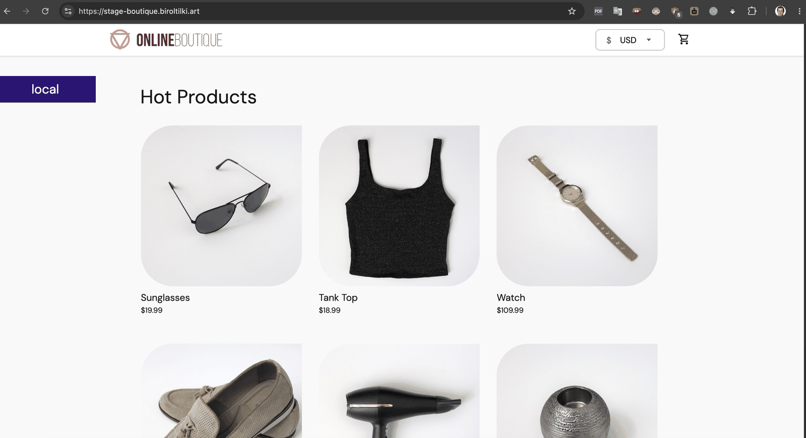
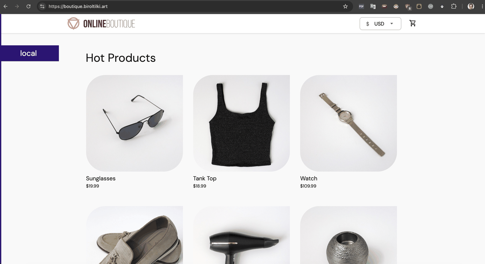

# 12 — Promotion (Stage + Prod)

**Audience:** L2 — Implementer
**Estimated time:** 120 minutes
**Prerequisites:** [10-boutique-dev.md](10-boutique-dev.md) ✅ · [11-observability.md](11-observability.md) ✅
**Creates:** Stage/prod overlays, Argo CD apps, ADO prod approval gate, promotion/rollback smoke tests
**Related ADRs:** [0008](../adr/0008-ado-prod-approval-gate.md), [0002](../adr/0002-single-cluster-multi-namespace.md)

---

## Topic goal

When this topic is complete, **the same signed image digest** validated in **dev** is promoted to **`boutique-stage`** and **`boutique-prod`** via GitOps, with **manual Argo CD sync** for stage/prod and **ADO environment approval** before prod Git updates. Stage is reachable at **`https://stage-boutique.biroltilki.art`** and prod at **`https://boutique.biroltilki.art`**.

## Why this topic is required

Production-pilot maturity requires environment separation, human gates, and repeatable promotion/rollback — not just a single dev deployment. This topic proves digest-immutable promotion across namespaces on one cluster.

---

## Before you begin

- [ ] Topic 10: dev healthy (`./tests/integration/dev-smoke.sh`)
- [ ] Topic 11: Grafana dashboards and alerts working
- [ ] Topic 09: signed digests in ACR; optional `digest-manifest` artifact from pipeline
- [ ] ADO permission to create **Environments** and **approvals**

```bash
kubectl get application -n argocd boutique-dev
./tests/integration/dev-smoke.sh
kubectl get pods -n monitoring | grep grafana
```

---

## Step 12.1: Review stage and prod overlays

### Goal

Understand namespace, hostname, and sync policy differences.

### Why this step is required

Stage and prod share `base/` but differ in ingress, namespace, and prod replica count.

### Commands

```bash
cd /path/to/boutique-aks-devsecops
tree gitops/apps/boutique/overlays -L 2
diff -u gitops/apps/boutique/overlays/dev/ingress.yaml gitops/apps/boutique/overlays/stage/ingress.yaml
cat gitops/apps/boutique/stage-application.yaml
cat gitops/apps/boutique/prod-application.yaml
```

### Environment matrix

| Env | Namespace | Hostname | Argo sync | ADO gate |
|-----|-----------|----------|-----------|----------|
| dev | `boutique-dev` | `dev-boutique.biroltilki.art` | Automatic | — |
| stage | `boutique-stage` | `stage-boutique.biroltilki.art` | **Manual** | — |
| prod | `boutique-prod` | `boutique.biroltilki.art` | **Manual** | **Approval** |

### Validation

- [ ] Prod overlay includes `replicas-patch.yaml` (frontend `replicas: 2`)
- [ ] Stage/prod Applications have **no** `automated` syncPolicy

---

## Step 12.2: Patch placeholders and register Argo apps

### Goal

Replace `<ACR_LOGIN_SERVER>` and GitHub `repoURL`; push so `apps-root` discovers stage/prod apps.

### Why this step is required

Argo CD must track three Boutique Applications under `gitops/apps/kustomization.yaml`.

### Commands

```bash
ACR_LOGIN="$(cd terraform/environments/dev && terraform output -raw acr_login_server)"

grep -rl '<ACR_LOGIN_SERVER>' gitops/apps/boutique/overlays/stage gitops/apps/boutique/overlays/prod | while read -r f; do
  sed -i.bak "s|<ACR_LOGIN_SERVER>|${ACR_LOGIN}|g" "$f" && rm -f "$f.bak"
done

# Edit stage-application.yaml and prod-application.yaml — <GITHUB_ORG>/<REPO_NAME>

kustomize build gitops/apps/boutique/overlays/stage | grep 'host:' | head -3
kustomize build gitops/apps/boutique/overlays/prod | grep 'replicas:' | head -3

git add gitops/apps/
git commit -m "feat(boutique): add stage and prod overlays with Argo CD apps"
git push origin main
```

Sync apps root:

```bash
argocd app sync apps-root --prune 2>/dev/null || true
kubectl get application -n argocd | grep boutique
```

### Validation

- [ ] `boutique-stage` and `boutique-prod` Applications exist (OutOfSync until first sync)
- [ ] No placeholder literals in pushed files

---

## Step 12.3: Configure ADO environments (GUI)

### Goal

Create **stage** and **prod** pipeline environments; prod requires manual approval.

### Why this step is required

ADR-0008 mandates ADO approval before prod overlay Git updates via `promote-digest.yml`.

### GUI steps

1. Azure DevOps → **Pipelines** → **Environments**
2. **New environment** → name: `stage` → Create (no checks required for test)
3. **New environment** → name: `prod` → Create
4. **prod** → **Approvals and checks** → **Approvals** → add yourself as approver → Save

Optional: add `dev` environment if using dev digest promotion from pipeline.

### Validation

- [ ] Environments `stage` and `prod` visible in ADO
- [ ] `prod` shows **Approvals** check enabled

---

## Step 12.4: Promote digest to stage

### Goal

Update stage overlay with same signed digests as dev; deploy via manual Argo sync.

### Why this step is required

Stage is the pre-prod validation environment — prod must not receive untested digests.

### Option A — Manual Git (first promotion)

Copy digest `images:` block from dev overlay (or build from `digest-manifest.json`):

```yaml
# gitops/apps/boutique/overlays/stage/kustomization.yaml
images:
  - name: <acr>.azurecr.io/frontend
    digest: sha256:<digest>
  # ... all 11 services
```

Example from pipeline artifact:

```bash
# jq helper — one service
jq -r '.frontend' digest-manifest.json
```

Commit, push, then:

```bash
argocd app sync boutique-stage --prune
kubectl get pods -n boutique-stage -w
```

### Option B — Promotion pipeline

Register `pipelines/azure-pipelines-promote.yml` in ADO (existing YAML path). Queue run on `main` — executes MirrorScanSign → Promote_stage → Promote_prod (prod waits for approval).

For **stage only**, stop after stage promote or use manual Git (Option A).

### DNS (stage)

```bash
INGRESS_IP="$(kubectl get svc -n ingress-nginx ingress-nginx-controller -o jsonpath='{.status.loadBalancer.ingress[0].ip}')"
RG="$(cd terraform/environments/dev && terraform output -raw resource_group_name)"
az network dns record-set a add-record \
  --resource-group "${RG}" --zone-name biroltilki.art \
  --record-set-name stage-boutique --ipv4-address "${INGRESS_IP}"
```

### Validation

```bash
chmod +x tests/integration/promotion-smoke.sh
./tests/integration/promotion-smoke.sh stage
kubectl get application -n argocd boutique-stage
```

- [ ] `boutique-stage` Synced / Healthy
- [ ] Stage smoke test passes
- [ ] Grafana shows stage namespace metrics (pod count)

---

## Step 12.5: Promote same digest to prod (with ADO approval)

### Goal

Prod overlay receives **identical** digest pins; ADO approves prod Git update; manual Argo sync.

### Why this step is required

Prod is customer-facing hostname (`boutique.biroltilki.art`) with explicit human gate.

### Commands

**Manual Git (recommended):**

1. Copy validated `images:` block from `overlays/stage/kustomization.yaml` to `overlays/prod/kustomization.yaml`
2. Commit: `promote(prod): same digest as stage validated <date>`
3. Push to `main`

**Pipeline:** Approve **prod** environment when `Promote_prod` deployment waits.

Deploy:

```bash
argocd app sync boutique-prod --prune
kubectl get pods -n boutique-prod
kubectl get deploy -n boutique-prod frontend -o jsonpath='{.spec.replicas}{"\n"}'
```

DNS (prod):

```bash
az network dns record-set a add-record \
  --resource-group "${RG}" --zone-name biroltilki.art \
  --record-set-name boutique --ipv4-address "${INGRESS_IP}"
```

Note: apex/host record name `boutique` for `boutique.biroltilki.art`.

### Validation

```bash
./tests/integration/promotion-smoke.sh prod
diff <(grep digest gitops/apps/boutique/overlays/stage/kustomization.yaml) \
     <(grep digest gitops/apps/boutique/overlays/prod/kustomization.yaml) || echo "Digests should match"
```

- [ ] ADO prod approval granted (if using pipeline)
- [ ] Frontend replicas = 2 in prod
- [ ] Prod smoke test passes

---

## Step 12.6: Full promotion validation

### Goal

Confirm all three environments on one digest (when pinned) and run integration smoke suite.

### Why this step is required

End-to-end proof before teardown topic and operational handoff.

### Commands

```bash
./tests/integration/dev-smoke.sh
./tests/integration/promotion-smoke.sh all

# Verify digest alignment (when images block populated)
for env in dev stage prod; do
  echo "=== ${env} ==="
  kubectl get deploy -n boutique-${env} frontend -o jsonpath='{.spec.template.spec.containers[0].image}{"\n"}' 2>/dev/null || \
    kubectl get deploy -n boutique-${env} frontend -o jsonpath='{.spec.template.spec.containers[0].image}{"\n"}'
done
```

### Validation

- [ ] All smoke scripts exit 0
- [ ] Argo CD shows three Boutique apps Healthy
- [ ] Same `@sha256:` on frontend across envs (when digest-pinned)

---

## Step 12.7: Rollback drill

### Goal

Practice Git revert + Argo sync rollback procedure.

### Why this step is required

Rollback confidence is required for production-pilot credibility.

### Commands

See [promotion-rollback.md](../runbooks/promotion-rollback.md).

Test drill (stage):

```bash
# Note current frontend image
kubectl get deploy -n boutique-stage frontend -o jsonpath='{.spec.template.spec.containers[0].image}'

# Revert last promotion commit (example)
git log -1 --oneline gitops/apps/boutique/overlays/stage/kustomization.yaml
# git revert <commit> && git push

argocd app sync boutique-stage --prune
chmod +x tests/integration/rollback-smoke.sh
./tests/integration/rollback-smoke.sh stage
```

### Validation

- [ ] Rollback runbook reviewed
- [ ] `rollback-smoke.sh` passes after revert + sync (or documented skip if no revert performed)

---

## Troubleshooting

| Symptom | Guide |
|---------|-------|
| Pipeline promote fails | [promotion-failures.md](../troubleshooting/promotion-failures.md) |
| Argo sync denied | [kyverno-admission.md](../troubleshooting/kyverno-admission.md) |
| TLS / DNS | [cert-manager-dns01.md](../troubleshooting/cert-manager-dns01.md) |
| Process / gates | [promotion-rollback.md](../runbooks/promotion-rollback.md) |

---

## Topic complete checklist

- [ ] Stage + prod overlays and Argo Applications deployed
- [ ] ADO `stage` and `prod` environments; prod approval configured
- [ ] DNS for `stage-boutique` and `boutique` hostnames
- [ ] Manual sync completed for stage and prod
- [ ] `promotion-smoke.sh` passes for stage and prod
- [ ] Rollback procedure documented and understood

**Screenshot references:**

Stage storefront (`https://stage-boutique.biroltilki.art`):



Prod storefront (`https://boutique.biroltilki.art`):



---

## Next step

**Topic 13 — Teardown:** Destroy Azure resources, validate cleanup, optional ACR destruction.

Guide: [13-teardown.md](13-teardown.md)

Topic 12 is complete — run Topic 13 when you are ready to destroy billable resources.

**Test note:** Stage/prod use digest pins; optional Boutique services may be scaled to 0 for cluster capacity.
